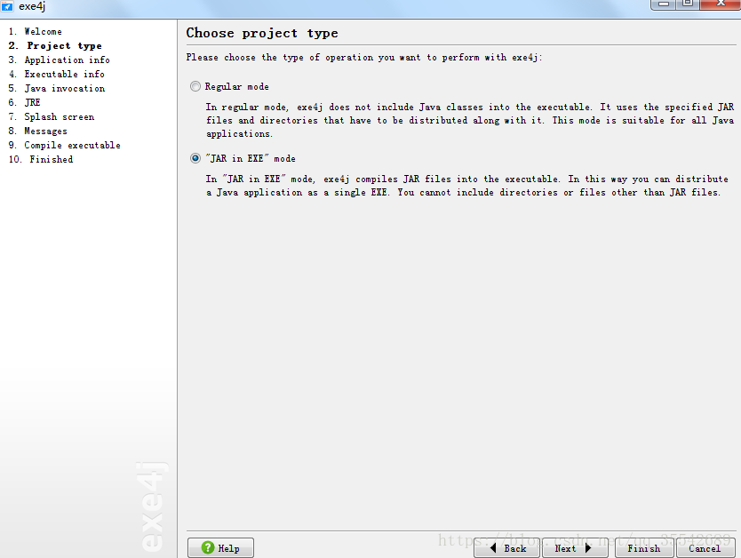
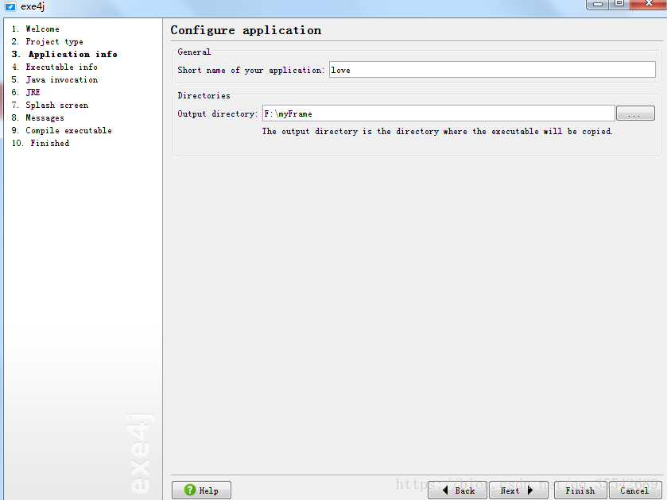
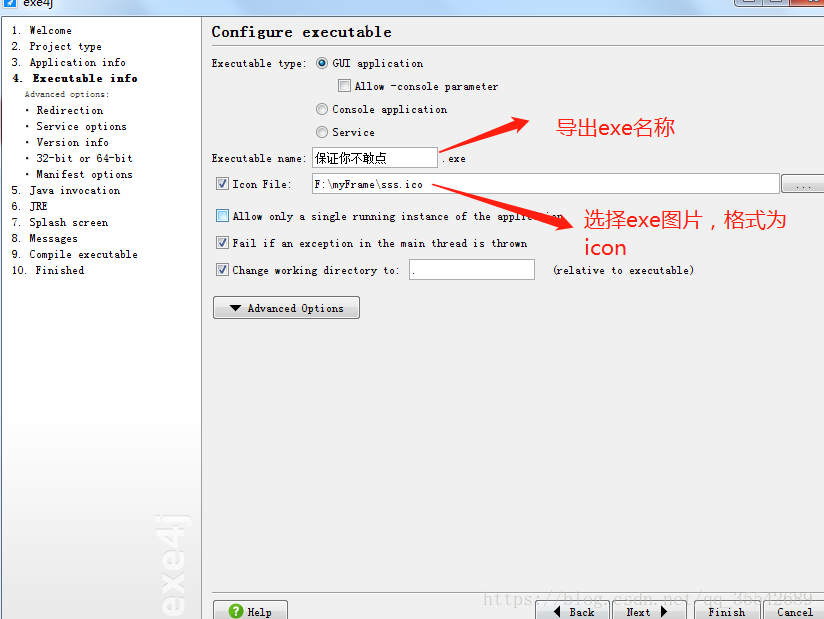
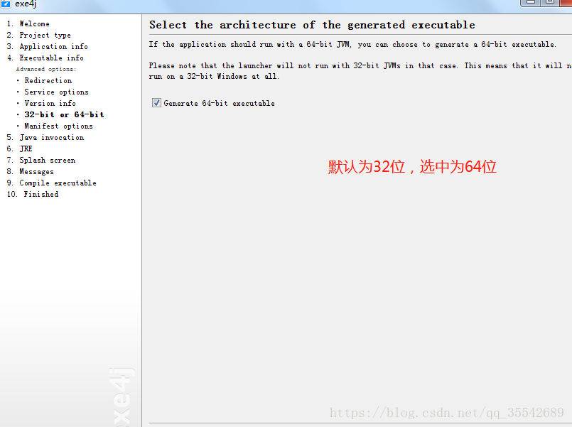
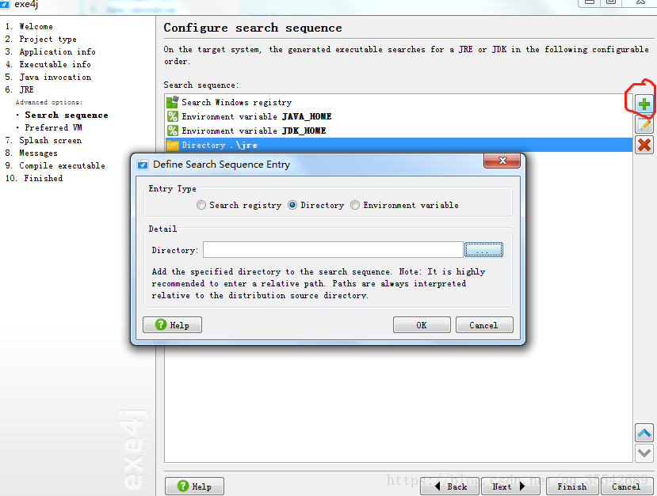
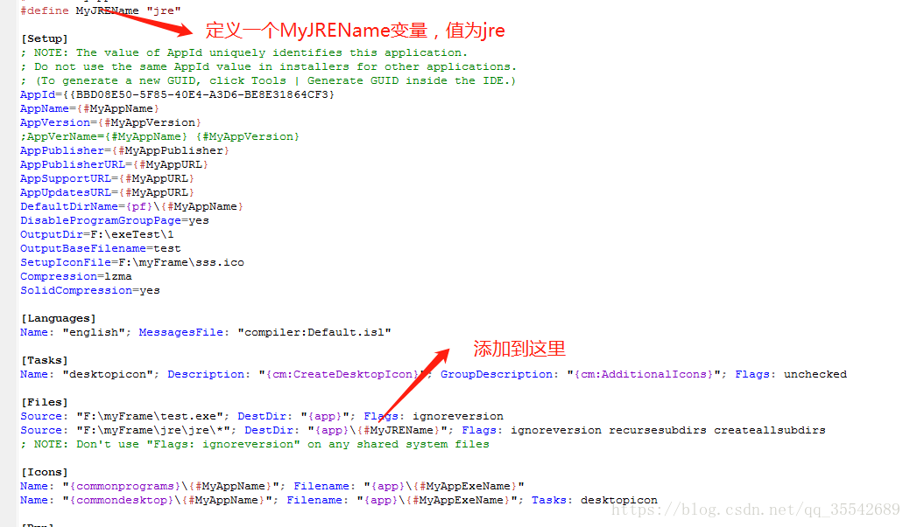

在Windows无jre环境中springboot项目打包成exe并运行。

(注意：不能捆绑jre，可采取将jre和exe压缩成7z格式的压缩文件)

激活码：A-XVK258563F-1p4lv7mg7sav

A-XVK209982F-1y0i3h4ywx2h1 

A-XVK267351F-dpurrhnyarva

A-XVK204432F-1kkoilo1jy2h3r

A-XVK246130F-1l7msieqiwqnq

A-XVK249554F-pllh351kcke50

A-XVK238729F-25yn13iea25i

A-XVK222711F-134h5ta8yxbm0

A-XVK275016F-15wjjcbn4tpj

A-XVK275016F-15wjjcbn4tpj 

启动文件：\exe4j\bin\exe4j.exe

我用的eclipse，将springboot通过maven build 打包成 jar在target中。既然是java程序，那么必须就要在java环境下才能运行，也就是所谓的jre。通过exe4j可以将jar打包成exe，并可以让jar自动去寻找jre，但是说并不是所谓的将jre装载到exe中，而且exe和jre必须在同一个父目录下。如果你移植到其他环境中，是无法知道该windows环境是否存在jre。所以jar只能在与自己同一目录去寻找是否有jre来运行自己，那么这个工作是由exe4j完成。

第二步选择 "JAR in EXE" mode

第三步选择exe导出路径

第四步 

第五步

 

这里只强调第6步，其实这一步是告诉jar你运行的时候如果没有java环境，那么你就找跟你同目录下的jre，并不是说把jre打包进exe里面去。请务必将jre路径与jar包路径在同一目录下。剩下点next即可，到第九步会自行编译出exe。

到这里，除非你要把jar和jre打包成zip，压缩包的形式移植到其他环境下。很显然这是十分不友好的，那么可以使用innosetup将exe和jre打包成安装包形式的exe。这样就显得很自然了。innosetup使用很简单，不作详说。有一个地方特别提醒一下。

如果不做此操作，那么exe安装出来的名为jre文件夹不存在了，innosetup会自动将jre里的文件解析出来，然而jar又只认识jre文件夹下的。所以会报错。

附上exe4j和innosetup下载地址

exe4j下载地址:http://www.softpedia.com/get/Authoring-tools/Setup-creators/exe4j.shtml

innosetup5.6.1下载地址:https://download.csdn.net/download/qq_35542689/10563727

原文链接：https://blog.csdn.net/qq_35542689/article/details/81205472