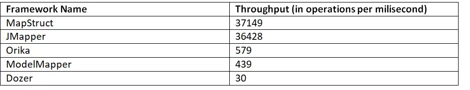
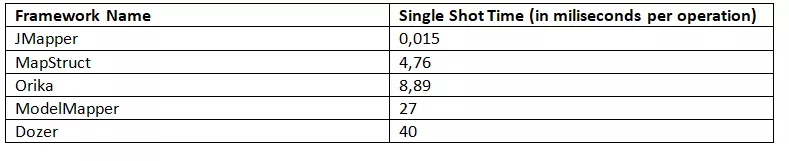
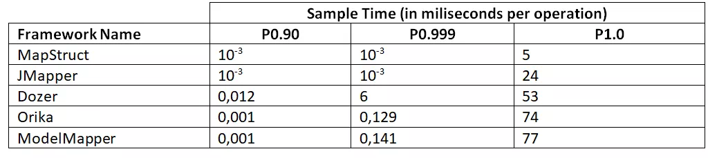

## 5种常见Bean映射工具的性能比对

原创： baeldung [JavaGuide](javascript:void(0);) *11月14日*

> 本文由 JavaGuide 翻译自 https://www.baeldung.com/java-performance-mapping-frameworks 。转载请注明原文地址以及翻译作者。
>
> 相关阅读：[Bean映射工具之Apache BeanUtils VS Spring BeanUtils](https://mp.weixin.qq.com/s?__biz=Mzg2OTA0Njk0OA==&mid=2247485789&idx=2&sn=c4c507a8df1101a723e220e9d464cd35&chksm=cea24696f9d5cf8066bf9a509d42b30b5cd5460abeefaa87bfff99ff71c143390bd52ed013c9&token=2052954611&lang=zh_CN&scene=21#wechat_redirect)

## 1. 介绍

创建由多个层组成的大型 Java 应用程序需要使用多种领域模型，如持久化模型、领域模型或者所谓的 DTO。为不同的应用程序层使用多个模型将要求我们提供 bean 之间的映射方法。手动执行此操作可以快速创建大量样板代码并消耗大量时间。幸运的是，Java 有多个对象映射框架。在本教程中，我们将比较最流行的 Java 映射框架的性能。

> 综合日常使用情况和相关测试数据，个人感觉 MapStruct、ModelMapper 这两个 Bean 映射框架是最佳选择。

## 2. 常见 Bean 映射框架概览

### 2.1. Dozer

Dozer 是一个映射框架，它使用递归将数据从一个对象复制到另一个对象。框架不仅能够在 bean 之间复制属性，还能够在不同类型之间自动转换。

要使用 Dozer 框架，我们需要添加这样的依赖到我们的项目:

```
<dependency>    <groupId>net.sf.dozer</groupId>    <artifactId>dozer</artifactId>    <version>5.5.1</version></dependency>
```

更多关于 Dozer 的内容可以在官方文档中找到：http://dozer.sourceforge.net/documentation/gettingstarted.html ，或者你也可以阅读这篇文章：https://www.baeldung.com/dozer 。

### 2.2. Orika

Orika 是一个 bean 到 bean 的映射框架，它递归地将数据从一个对象复制到另一个对象。

Orika 的工作原理与 Dozer 相似。两者之间的主要区别是 Orika 使用字节码生成。这允许以最小的开销生成更快的映射器。

要使用 Orika 框架，我们需要添加这样的依赖到我们的项目:

```
<dependency>    <groupId>ma.glasnost.orika</groupId>    <artifactId>orika-core</artifactId>    <version>1.5.2</version></dependency>
```

更多关于 Orika 的内容可以在官方文档中找到：https://orika-mapper.github.io/orika-docs/，或者你也可以阅读这篇文章：https://www.baeldung.com/orika-mapping。

### 2.3. MapStruct

MapStruct 是一个自动生成 bean mapper 类的代码生成器。MapStruct 还能够在不同的数据类型之间进行转换。Github 地址：https://github.com/mapstruct/mapstruct。

要使用 MapStruct 框架，我们需要添加这样的依赖到我们的项目:

```
<dependency>    <groupId>org.mapstruct</groupId>    <artifactId>mapstruct-processor</artifactId>    <version>1.2.0.Final</version></dependency>
```

更多关于 MapStruct 的内容可以在官方文档中找到：https://mapstruct.org/，或者你也可以阅读这篇文章：https://www.baeldung.com/mapstruct。

要使用 MapStruct 框架，我们需要添加这样的依赖到我们的项目:

```
<dependency>    <groupId>org.mapstruct</groupId>    <artifactId>mapstruct-processor</artifactId>    <version>1.2.0.Final</version></dependency>
```

### 2.4. ModelMapper

ModelMapper 是一个旨在简化对象映射的框架，它根据约定确定对象之间的映射方式。它提供了类型安全的和重构安全的 API。

更多关于 ModelMapper 的内容可以在官方文档中找到：http://modelmapper.org/ 。

要使用 ModelMapper 框架，我们需要添加这样的依赖到我们的项目:

```
<dependency>  <groupId>org.modelmapper</groupId>  <artifactId>modelmapper</artifactId>  <version>1.1.0</version></dependency>
```

### 2.5. JMapper

JMapper 是一个映射框架，旨在提供易于使用的、高性能的 Java bean 之间的映射。该框架旨在使用注释和关系映射应用 DRY 原则。该框架允许不同的配置方式:基于注释、XML 或基于 api。

更多关于 JMapper 的内容可以在官方文档中找到：https://github.com/jmapper-framework/jmapper-core/wiki。

要使用 JMapper 框架，我们需要添加这样的依赖到我们的项目:

```
<dependency>    <groupId>com.googlecode.jmapper-framework</groupId>    <artifactId>jmapper-core</artifactId>    <version>1.6.0.1</version></dependency>
```

## 3.测试模型

为了能够正确地测试映射，我们需要有一个源和目标模型。我们已经创建了两个测试模型。

第一个是一个只有一个字符串字段的简单 POJO，它允许我们在更简单的情况下比较框架，并检查如果我们使用更复杂的 bean 是否会发生任何变化。

简单的源模型如下:

```
public class SourceCode {    String code;    // getter and setter}
```

它的目标也很相似:

```
public class DestinationCode {    String code;    // getter and setter}
```

源 bean 的实际示例如下:

```
public class SourceOrder {    private String orderFinishDate;    private PaymentType paymentType;    private Discount discount;    private DeliveryData deliveryData;    private User orderingUser;    private List<Product> orderedProducts;    private Shop offeringShop;    private int orderId;    private OrderStatus status;    private LocalDate orderDate;    // standard getters and setters}
```

目标类如下图所示:

```
public class Order {    private User orderingUser;    private List<Product> orderedProducts;    private OrderStatus orderStatus;    private LocalDate orderDate;    private LocalDate orderFinishDate;    private PaymentType paymentType;    private Discount discount;    private int shopId;    private DeliveryData deliveryData;    private Shop offeringShop;    // standard getters and setters}
```

整个模型结构可以在这里找到:https://github.com/eugenp/tutorials/tree/master/performance-tests/src/main/java/com/baeldung/performancetests/model/source。

## 4. 转换器

为了简化测试设置的设计，我们创建了如下所示的转换器接口:

```
public interface Converter {    Order convert(SourceOrder sourceOrder);    DestinationCode convert(SourceCode sourceCode);}
```

我们所有的自定义映射器都将实现这个接口。

### 4.1. OrikaConverter

Orika 支持完整的 API 实现，这大大简化了 mapper 的创建:

```
public class OrikaConverter implements Converter{    private MapperFacade mapperFacade;    public OrikaConverter() {        MapperFactory mapperFactory = new DefaultMapperFactory          .Builder().build();        mapperFactory.classMap(Order.class, SourceOrder.class)          .field("orderStatus", "status").byDefault().register();        mapperFacade = mapperFactory.getMapperFacade();    }    @Override    public Order convert(SourceOrder sourceOrder) {        return mapperFacade.map(sourceOrder, Order.class);    }    @Override    public DestinationCode convert(SourceCode sourceCode) {        return mapperFacade.map(sourceCode, DestinationCode.class);    }}
```

### 4.2. **DozerConverter**

Dozer 需要 XML 映射文件，有以下几个部分:

```
<mappings xmlns="http://dozer.sourceforge.net"  xmlns:xsi="http://www.w3.org/2001/XMLSchema-instance"  xsi:schemaLocation="http://dozer.sourceforge.net  http://dozer.sourceforge.net/schema/beanmapping.xsd">    <mapping>        <class-a>com.baeldung.performancetests.model.source.SourceOrder</class-a>        <class-b>com.baeldung.performancetests.model.destination.Order</class-b>        <field>            <a>status</a>            <b>orderStatus</b>        </field>    </mapping>    <mapping>        <class-a>com.baeldung.performancetests.model.source.SourceCode</class-a>        <class-b>com.baeldung.performancetests.model.destination.DestinationCode</class-b>    </mapping></mappings>
```

定义了 XML 映射后，我们可以从代码中使用它:

```
public class DozerConverter implements Converter {    private final Mapper mapper;    public DozerConverter() {        DozerBeanMapper mapper = new DozerBeanMapper();        mapper.addMapping(          DozerConverter.class.getResourceAsStream("/dozer-mapping.xml"));        this.mapper = mapper;    }    @Override    public Order convert(SourceOrder sourceOrder) {        return mapper.map(sourceOrder,Order.class);    }    @Override    public DestinationCode convert(SourceCode sourceCode) {        return mapper.map(sourceCode, DestinationCode.class);    }}
```

### 4.3. MapStructConverter

Map 结构的定义非常简单，因为它完全基于代码生成:

```
@Mapperpublic interface MapStructConverter extends Converter {    MapStructConverter MAPPER = Mappers.getMapper(MapStructConverter.class);    @Mapping(source = "status", target = "orderStatus")    @Override    Order convert(SourceOrder sourceOrder);    @Override    DestinationCode convert(SourceCode sourceCode);}
```

### 4.4. **JMapperConverter**

JMapperConverter 需要做更多的工作。接口实现后:

```
public class JMapperConverter implements Converter {    JMapper realLifeMapper;    JMapper simpleMapper;    public JMapperConverter() {        JMapperAPI api = new JMapperAPI()          .add(JMapperAPI.mappedClass(Order.class));        realLifeMapper = new JMapper(Order.class, SourceOrder.class, api);        JMapperAPI simpleApi = new JMapperAPI()          .add(JMapperAPI.mappedClass(DestinationCode.class));        simpleMapper = new JMapper(          DestinationCode.class, SourceCode.class, simpleApi);    }    @Override    public Order convert(SourceOrder sourceOrder) {        return (Order) realLifeMapper.getDestination(sourceOrder);    }    @Override    public DestinationCode convert(SourceCode sourceCode) {        return (DestinationCode) simpleMapper.getDestination(sourceCode);    }}
```

我们还需要向目标类的每个字段添加`@JMap`注释。此外，JMapper 不能在 enum 类型之间转换，它需要我们创建自定义映射函数:

```
@JMapConversion(from = "paymentType", to = "paymentType")public PaymentType conversion(com.baeldung.performancetests.model.source.PaymentType type) {    PaymentType paymentType = null;    switch(type) {        case CARD:            paymentType = PaymentType.CARD;            break;        case CASH:            paymentType = PaymentType.CASH;            break;        case TRANSFER:            paymentType = PaymentType.TRANSFER;            break;    }    return paymentType;}
```

### 4.5. **ModelMapperConverter**

ModelMapperConverter 只需要提供我们想要映射的类:

```
public class ModelMapperConverter implements Converter {    private ModelMapper modelMapper;    public ModelMapperConverter() {        modelMapper = new ModelMapper();    }    @Override    public Order convert(SourceOrder sourceOrder) {       return modelMapper.map(sourceOrder, Order.class);    }    @Override    public DestinationCode convert(SourceCode sourceCode) {        return modelMapper.map(sourceCode, DestinationCode.class);    }}
```

## 5. 简单的模型测试

对于性能测试，我们可以使用 Java Microbenchmark Harness，关于如何使用它的更多信息可以在 这篇文章：https://www.baeldung.com/java-microbenchmark-harness 中找到。

我们为每个转换器创建了一个单独的基准测试，并将基准测试模式指定为 Mode.All。

### 5.1. 平均时间

对于平均运行时间，JMH 返回以下结果(越少越好):

AverageTime

这个基准测试清楚地表明，MapStruct 和 JMapper 都有最佳的平均工作时间。

### 5.2. 吞吐量

在这种模式下，基准测试返回每秒的操作数。我们收到以下结果(越多越好):

Throughput

在吞吐量模式中，MapStruct 是测试框架中最快的，JMapper 紧随其后。

### 5.3. **SingleShotTime**

这种模式允许测量单个操作从开始到结束的时间。基准给出了以下结果(越少越好):

SingleShotTime

这里，我们看到 JMapper 返回的结果比 MapStruct 好得多。

### 5.4. **采样时间**

这种模式允许对每个操作的时间进行采样。三个不同百分位数的结果如下:

SampleTime

所有的基准测试都表明，根据场景的不同，MapStruct 和 JMapper 都是不错的选择，尽管 MapStruct 对 SingleShotTime 给出的结果要差得多。

## 6. 真实模型测试

对于性能测试，我们可以使用 Java Microbenchmark Harness，关于如何使用它的更多信息可以在 这篇文章：https://www.baeldung.com/java-microbenchmark-harness 中找到。

我们为每个转换器创建了一个单独的基准测试，并将基准测试模式指定为 Mode.All。

### 6.1. 平均时间

JMH 返回以下平均运行时间结果（越少越好）：

平均时间

该基准清楚地表明，MapStruct 和 JMapper 均具有最佳的平均工作时间。

### 6.2. 吞吐量

在这种模式下，基准测试返回每秒的操作数。我们收到以下结果(越多越好):


在吞吐量模式中，MapStruct 是测试框架中最快的，JMapper 紧随其后。

### 6.3. **SingleShotTime**

这种模式允许测量单个操作从开始到结束的时间。基准给出了以下结果(越少越好):


### 6.4. **采样时间**

这种模式允许对每个操作的时间进行采样。三个不同百分位数的结果如下:

SampleTime

尽管简单示例和实际示例的确切结果明显不同，但是它们的趋势相同。在哪种算法最快和哪种算法最慢方面，两个示例都给出了相似的结果。

### 6.5. 结论

根据我们在本节中执行的真实模型测试，我们可以看出，最佳性能显然属于 MapStruct。在相同的测试中，我们看到 Dozer 始终位于结果表的底部。

## 7. 总结

在这篇文章中，我们已经进行了五个流行的 Java Bean 映射框架性能测试：ModelMapper **，** MapStruct **，** Orika ，Dozer， JMapper。

示例代码地址：https://github.com/eugenp/tutorials/tree/master/performance-tests。