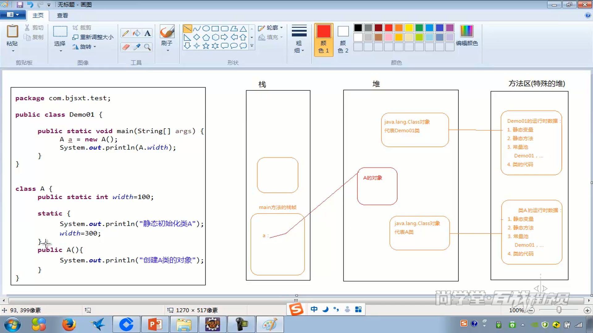

Bootstrap ClassLoade https://www.cnblogs.com/pony1223/p/7711092.html

https://blog.csdn.net/briblue/article/details/54973413

注意的是：

1.类加载器本身也是一个java类,因为类加载器本身也是一个java类,那么这个特殊的java类【类加载器】是有谁加载进来的呢?这显然要有第一个类加载器，这第一个类加载器不是一个java类，它是BootStrap。

2.BootStrap classloader不是一个java类，不需要类加载器java加载，他是嵌套在java虚拟机内核里面的。java 虚拟机内核已启动的时候，他就已经在那里面了，他是用c++语言写的一段二进制代码。他可以去加载别的类，其中别的类就包含了类加载器【如上面提到的Ext  和 app】。

3.请注意static final编译器直接进入常量 ，与static不同

4.双亲委派的安全性，就是使得顶级加载器不会去加载新建的string类

4.双亲委派有一定的局限性，比如jdbc的驱动实现

5.tomcat出于安全性有自己的类加载器，是先尝试自己加载，无法加载的由父类加载