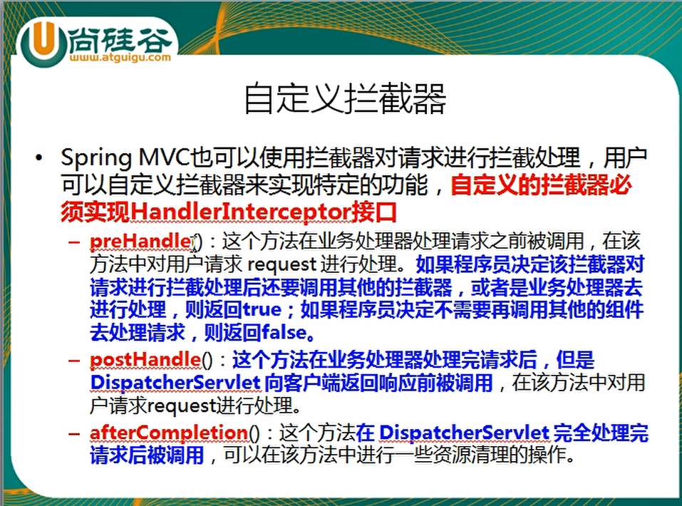

过滤器的实现基于回调函数。而拦截器（代理模式）的实现基于反射，代理又分静态代理和动态代理，动态代理是拦截器的简单实现。那何时使用拦截器？何时使用过滤器？

- 如果是非spring项目，那么拦截器不能用，只能使用过滤器，这里说的拦截器是基于spring的拦截器。
- 如果是处理controller前后，既可以使用拦截器也可以使用过滤器，如果都使用了，注意前后顺序。
- 如果是处理dispaterServlet前后，只能使用过滤器。

实现 WebMvcConfigurer


```java
@Configuration
public class MyInterceptor implements WebMvcConfigurer {

    @Override
    public void addInterceptors(InterceptorRegistry registry) {
        registry.addInterceptor(new HandlerInterceptor() {
            @Override
            public boolean preHandle(HttpServletRequest request, HttpServletResponse response, Object handler) throws Exception {
                System.out.println("我进来了");
                return true;
            }

            @Override
            public void postHandle(HttpServletRequest request, HttpServletResponse response, Object handler, ModelAndView modelAndView) throws Exception {
                Log log = LogFactory.getLog(this.getClass());
                //如果是SpringMVC请求
                //可以反射获得Controll层请求方法的信息
                if(handler instanceof HandlerMethod){
                    HandlerMethod handlerMethod = (HandlerMethod) handler;
                    log.info("当前拦截的方法为：{}"+handlerMethod.getMethod().getName());
                    log.info("当前拦截的方法参数长度为：{}"+handlerMethod.getMethod().getParameters().length);
                    log.info("当前拦截的方法为：{}"+handlerMethod.getBean().getClass().getName());
                    System.out.println("开始拦截---------");
                    String uri = request.getRequestURI();
                    System.out.println("拦截的uri："+uri);
                }

            }

            @Override
            public void afterCompletion(HttpServletRequest request, HttpServletResponse response, Object handler, Exception ex) throws Exception {

            }
        });
    }
}
```





#### 新建HandlerInterceptor并注册到WebMvcConfigurer

```java
public class LoginHandlerInterceptor implements HandlerInterceptor {
    //目标方法执行之前
    @Override
    public boolean preHandle(HttpServletRequest request, HttpServletResponse response, Object handler) throws Exception {
        Object user = request.getSession().getAttribute("loginUser");
        if (user == null) {
            //未登陆，返回登陆页面
            request.setAttribute("msg", "没有权限请先登陆");
            request.getRequestDispatcher("/index.html").forward(request, response);
            return false;
        } else {
            //已登陆，放行请求
            return true;
        }
    }
}


@Configuration
public class MyMVCConfig implements WebMvcConfigurer {
    @Override
    public void addViewControllers(ViewControllerRegistry registry) {
        registry.addViewController("/").setViewName("login");
        registry.addViewController("/index.html").setViewName("login");
        registry.addViewController("/main.html").setViewName("dashboard");
    }

    // 注册拦截器
    @Override
    public void addInterceptors(InterceptorRegistry registry) {
        // super.addInterceptors(registry);
        // 静态资源； *.css , *.js
        // SpringBoot已经做好了静态资源映射
        // "/**"表示包含子路径的所有路径
        registry.addInterceptor(new LoginHandlerInterceptor()).addPathPatterns("/**")
                .excludePathPatterns("/index.html", "/", "/user/login");
    }
}
```

