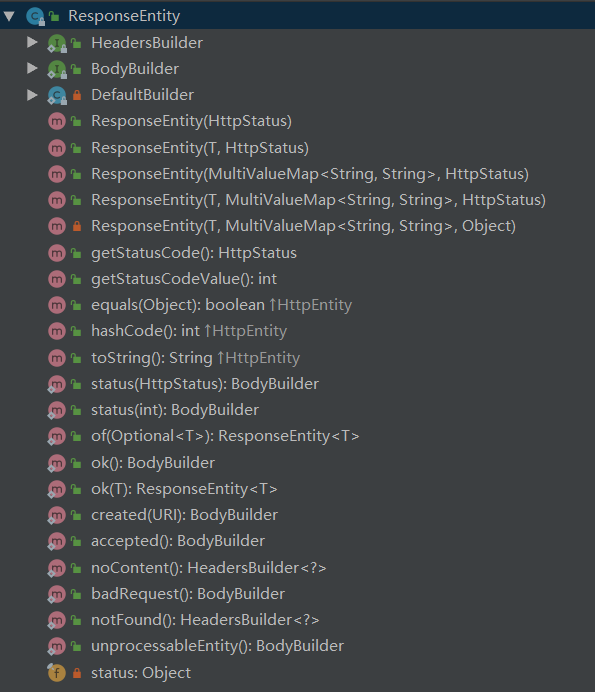

```java
@RestController
public class Controller {

    @RequestMapping("/hello")
    public String hello(){
        return "hello world!";
    }

    @RequestMapping("/student")
    public ResponseEntity<Student> student(){
        //ResponseEntity<T> 的作用再用可以返回状态码status
        //@ResponseBody 返回ResponseEntity<T> 的 T
        Student student = new Student(1, "张三");
        //ResponseEntity.status(HttpStatus.OK).body(student) 的简便写法
        ResponseEntity.ok(student);
        return ResponseEntity.status(HttpStatus.OK).body(student);
    }
}
```





