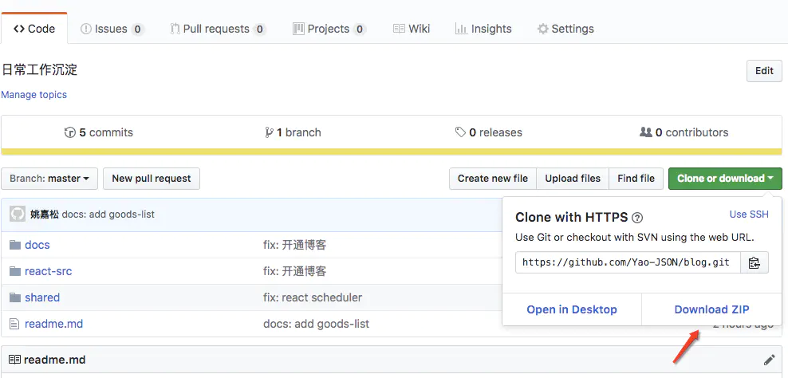

https://juejin.im/post/5bdd58db51882517217fb36d


# 如何巧妙的实现文件下载

## 如何巧妙的实现文件下载

文件上传下载在业务开发中非常常见，尤其在企业级应用中；实现图片、报表类文件的下载居多。最近我有赞商品中心后台商品批量改价功能模块与堂食点单插件功能模块中就遇到文件下载的需求。

## 常见的处理方式

一般在文件下载的方式：

#### window.open

```
window.open("htpp://127.0.0.1/test.rar");
复制代码
```

使用 `window.open` 是可以实现文件的下载，正常的 `zip` 、 `rar` 、 `arj` 等文件是可以使用 `window.open` 打开的；`window.open` 能够打开的原理是让我门用浏览器打开一个文件时，如果浏览器无法解析，它就会把该文件下载下来。比如： `html` 、 `pdf` 、 `png` 等使用 `window.open` 是无法打开的。

另外一点，使用 `window.open` 会受到浏览器安全策略的限制，会静默该行为。

#### window.location

使用 `window.location.href ='xxx.zip'` 或者 `window.location='xxx.zip'` 实现文件的下载； 但是该方法不仅具有 `window.open` 的限制，还会受到浏览器兼容性的影响。

#### a 标签

还有一种处理方式：使用 H5 `a` 标签 [download](https://www.zhangxinxu.com/wordpress/2016/04/know-about-html-download-attribute/) 新特性，其是规定超链接下载的目标。比如

```
<a href="https://github.com/Yao-JSON/blog/archive/master.zip" download="blog">
  Download ZIP
</a>
复制代码
```

该方法兼容性较好，而且交互体验友好，不需要打开一个新的窗口，在当前窗口下实现下载。最具代表性的解决案例是：`Github Docunload Zip` ；





但是该方案仅适用于已知的服务器端静态资源文件下载，在业务上很有局限性。通常在业务开发中，文件通常是后端生成动态的下载，所以以下才是正确的处理方式。

## 动态的创建 a 标签

动态创建 `a` 标签，实施下载；顾名思义，就是创建一个 `a` 标签，添加 `href` 、 `download` 属性，模拟用户点击，实现下载。 具体代码如下：兼容()

```
const downloadFile = (url, fileName = '') => {
  let eleLink = document.createElement('a');
  eleLink.download = fileName;
  eleLink.style.display = 'none';
  eleLink.href = url;
  // 受浏览器安全策略的因素，动态创建的元素必须添加到浏览器后才能实施点击
  document.body.appendChild(eleLink);
  // 触发点击  
  eleLink.click();
  // 然后移除
  document.body.removeChild(eleLink);
};

export default downloadFile;
复制代码
```

## 其他下载

#### 如何下载 html 片段或者文本

```
import downloadFile from './downloadFile';

const debug = ['<a id="a"><b id="b">hey!</b></a>'];
const blob = new Blob(debug,{
    type: 'text/html'
})

const url = URL.createObjectURL(blob);

downloadFile(url, 'index.html');

复制代码
```

#### 图片是base64 如何实现下载

```
import downloadFile from './downloadFile';

const debug = ['base:...'];
const blob = new Blob(debug,{
    type: 'text/html'
})

const url = URL.createObjectURL(blob);

downloadFile(url, 'index.html');
复制代码
```

#### canvas 下载

```
import downloadFile from './downloadFile';

const canvas = document.createElement('canvas');
const ctx = canvas.getContext('2d');
...
...
...
const src = canvas.toDataURL('image/png')

downloadFile(src, 'canavs.png')
复制代码
```

实施案例：