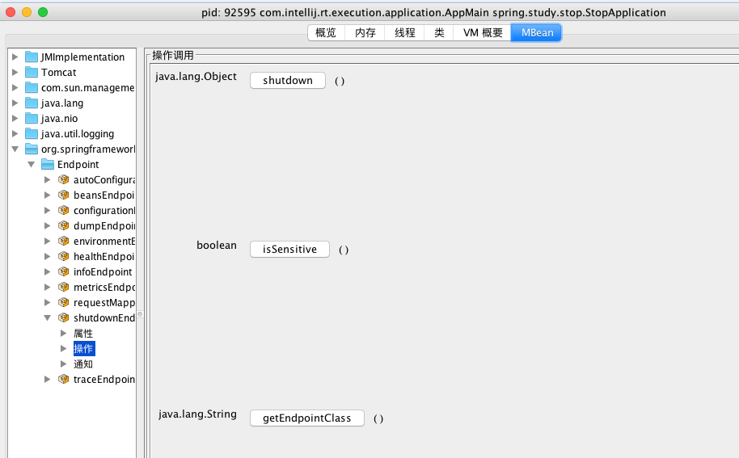
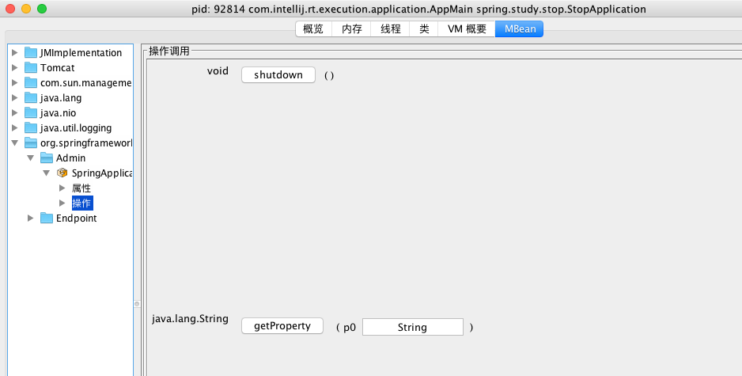

https://fangjian0423.github.io/2017/06/28/springboot-application-exit/


SpringApplication的exit静态方法

```java
@Autowired
private ApplicationContext applicationContext;

@PostMapping("/stop")
public String stop() {
		// 退出码可以不加
    SpringApplication.exit(applicationContext, new ExitCodeGenerator() {
			@Override
			public int getExitCode() {
				return 22;
			}
		});
    return "ok";
}
```


SpringBoot应用程序的关闭目前总结起来有4种方式：

1. Rest接口：使用spring-boot-starter-actuator模块里的ShutdownEndpoint
2. SpringApplication的exit静态方法：直接调用该静态方法即可
3. JMX：使用SpringBoot内部提供的MXBean
4. 使用第三方进程管理工具


## Rest接口

Rest接口使用Endpoint暴露出来，需要引入[spring-boot-starter-actuator](https://docs.spring.io/spring-boot/docs/current-SNAPSHOT/reference/htmlsingle/#production-ready-endpoints)这个stater。

这个关闭应用程序对应的Endpoint是ShutdownEndpoint，直接调用ShutdownEndpoint提供的rest接口即可。得先开启ShutdownEndpoint(默认不开启)，以及不进行安全监测：

```
endpoints.shutdown.enabled: trueendpoints.shutdown.sensitive: false
```

然后调用rest接口：

```
curl -X POST http://localhost:8080/shutdown
```

可以使用spring-security进行安全监测：

```
endpoints.shutdown.sensitive: truesecurity.user.name: adminsecurity.user.password: adminmanagement.security.role: SUPERUSER
```

然后使用用户名和密码进行调用：

```
curl -u admin:admin -X POST http://127.0.0.1:8080/shutdown
```

这个ShutdownEndpoint底层其实就是调用了Spring容器的close方法：

```
@Overridepublic Map<String, Object> invoke() {	if (this.context == null) {		return Collections.<String, Object>singletonMap("message",				"No context to shutdown.");	}	try {		return Collections.<String, Object>singletonMap("message",				"Shutting down, bye...");	}	finally {		new Thread(new Runnable() {			@Override			public void run() {				try {					Thread.sleep(500L);				}				catch (InterruptedException ex) {					// Swallow exception and continue				}				ShutdownEndpoint.this.context.close();			}		}).start();	}}
```

## SpringApplication的exit静态方法

SpringApplication提供了一个exit静态方法，用于关闭Spring容器，该方法还有一个参数exitCodeGenerators表示ExitCodeGenerator接口的数组。ExitCodeGenerator接口是一个生成退出码exitCode的生成器。

```
public static int exit(ApplicationContext context,		ExitCodeGenerator... exitCodeGenerators) {	Assert.notNull(context, "Context must not be null");	int exitCode = 0; // 默认的退出码是0	try {		try {			// 构造ExitCodeGenerator集合			ExitCodeGenerators generators = new ExitCodeGenerators();			// 获得Spring容器中所有的ExitCodeGenerator类型的bean			Collection<ExitCodeGenerator> beans = context					.getBeansOfType(ExitCodeGenerator.class).values();			// 集合加上参数中的ExitCodeGenerator数组			generators.addAll(exitCodeGenerators);			// 集合加上Spring容器中的ExitCodeGenerator集合			generators.addAll(beans);			// 遍历每个ExitCodeGenerator，得到最终的退出码exitCode			// 这里每个ExitCodeGenerator生成的退出码如果比0大，那么取最大的			// 如果比0小，那么取最小的			exitCode = generators.getExitCode();			if (exitCode != 0) { // 如果退出码exitCode不为0，发布ExitCodeEvent事件				context.publishEvent(new ExitCodeEvent(context, exitCode));			}		}		finally {			// 关闭Spring容器			close(context);		}	}	catch (Exception ex) {		ex.printStackTrace();		exitCode = (exitCode == 0 ? 1 : exitCode);	}	return exitCode;}
```

我们写个Controller直接调用exit方法：

```
@Autowiredprivate ApplicationContext applicationContext;@PostMapping("/stop")public String stop() {		// 加上自己的权限验证    SpringApplication.exit(applicationContext);    return "ok";}
```

## JMX

[spring-boot-starter-actuator](https://docs.spring.io/spring-boot/docs/current-SNAPSHOT/reference/htmlsingle/#production-ready-endpoints)这个stater内部会构造ShutdownEndpointMBean。

使用jconsole可以看到这个MBean：

[](https://raw.githubusercontent.com/fangjian0423/blogimages/master/images/springboot-stop01.png)

SpringBoot内部也提供了一个SpringApplicationAdminMXBean，但是需要开启：

```
spring.application.admin.enabled: true
```

[](https://raw.githubusercontent.com/fangjian0423/blogimages/master/images/springboot-stop02.png)

## 使用第三方进程管理工具

比如我们的应用程序部署在linux系统上，可以借助一些第三方的进程管理工具管理应用程序的运行，比如[supervisor](http://www.supervisord.org/)。

设置program：

```
[program:stop-application]command=java -jar /yourjar.jarprocess_name=%(program_name)sstartsecs=10autostart=falseautorestart=falsestdout_logfile=/tmp/stop.logstderr_logfile=/tmp/stop-error.log
```

使用supervisorctl进入控制台操作应用程序：

```
supervisor> statusstop-application                 STOPPED   Jun 27 03:50 PMsupervisor> start stop-applicationstop-application: startedsupervisor> statusstop-application                 RUNNING   pid 27918, uptime 0:00:11supervisor> stop stop-applicationstop-application: stoppedsupervisor> statusstop-application                 STOPPED   Jun 27 03:50 PM
```

如果觉得我的文章对您有用，请随意打赏。您的支持将鼓励我继续创作！