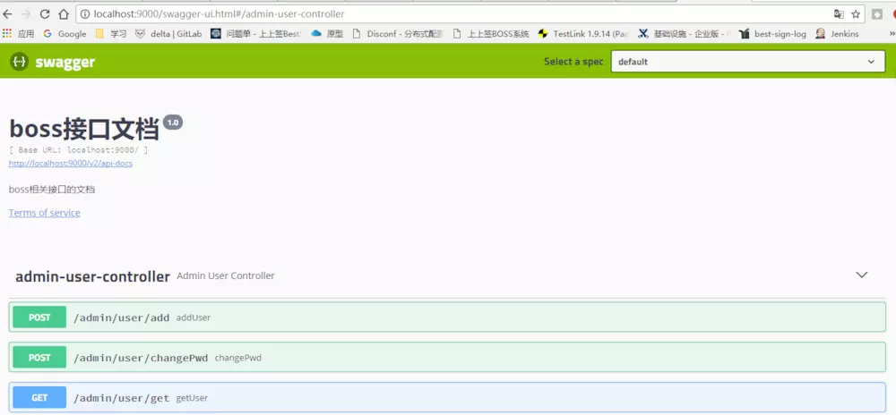

# spring boot项目中使用swagger2


 

[1994_老叶](https://www.jianshu.com/u/7608809c2025)

 

关注

 0.5 2018.07.19 20:53* 字数 1135 阅读 11581评论 0喜欢 14

在工作中的项目中，我们经常在一开始和前端的合作中写好接口文档，然后前端根据接口文档进行相关的对接工作，但是在后期的维护中，如果改动或者新增接口，可能直接和前端约定好，而不去维护接口文档，这样如果在将项目交付其他人的时候，这个接口文档可能是滞后的，于是在实际中，我们准备使用swagger构建在线接口文档，但是在真正接触swagger后，我觉得这可能不是一个好的方案。

#### 一.介绍一下swagger

简单说明一下，Swagger 是一个规范和完整的框架，用于生成、描述、调用和可视化 RESTful 风格的 Web 服务的接口文档。

#### 二.如何使用

首先介绍一下，使用的spring boot+maven构建的web项目，所以我们的步骤是：
第一步，pom文件中引入依赖

```
  <dependency>
            <groupId>io.springfox</groupId>
            <artifactId>springfox-swagger2</artifactId>
            <version>2.9.2</version>
        </dependency>
        <dependency>
            <groupId>io.springfox</groupId>
            <artifactId>springfox-swagger-ui</artifactId>
            <version>2.8.0</version>
        </dependency>
```

简单的实现就引入这两个依赖，然后进行下一步。
第二步，写配置文件

```
package cn.zh.demo.config;

import io.swagger.annotations.Api;
import org.springframework.context.annotation.Bean;
import org.springframework.context.annotation.Configuration;
import springfox.documentation.builders.ApiInfoBuilder;
import springfox.documentation.builders.PathSelectors;
import springfox.documentation.builders.RequestHandlerSelectors;
import springfox.documentation.service.ApiInfo;
import springfox.documentation.spi.DocumentationType;
import springfox.documentation.spring.web.plugins.Docket;
import springfox.documentation.swagger2.annotations.EnableSwagger2;

@Configuration
@EnableSwagger2
public class Swagger2Configuration {

    @Bean
    public Docket createRestApi() {
        return new Docket(DocumentationType.SWAGGER_2)
                .apiInfo(apiInfo())
                .select()
                .apis(RequestHandlerSelectors.withClassAnnotation(Api.class))//这是注意的代码
                .paths(PathSelectors.any())
                .build();
    }

    private ApiInfo apiInfo() {
        return new ApiInfoBuilder()
                .title("xxx接口文档")
                .description("xxx相关接口的文档")
                .termsOfServiceUrl("http://www.xxx.com")
                .version("1.0")
                .build();
    }

}
```

注意的这行代码：apis(RequestHandlerSelectors.withClassAnnotation(Api.class)),这个代码说明的我们扫描的哪些接口，我这行意思是扫描带@Api注解的接口类，这里selector有5个方法来应对扫描需求，其中basePackage()方法是按照接口类所在的包的位置(在我的代码中这里就应该填“ cn.zh.demo.controller”）,需多的人说这个配置类应该与Application类在同一级目录，但是我实际测试是不需要的，放在自己想要的放的位置即可。
第三步：增加相关的注解

```
package cn.bestsign.delta.aggregation.boss.web;

import com.github.pagehelper.PageInfo;
import io.swagger.annotations.Api;
import io.swagger.annotations.ApiImplicitParam;
import io.swagger.annotations.ApiImplicitParams;
import org.springframework.web.bind.annotation.*;

import javax.annotation.Resource;
import java.util.ArrayList;
import java.util.List;

/**
 * @author : leo
 * @company 杭州尚尚签网络科技有限公司
 * @date : 2017/12/1
 * @since 3.0
 */

@Api(value = "AdminUserController ")
@RestController
@RequestMapping("/admin/user")
public class AdminUserController extends BaseController {
    /**
     * 用户登录
     */
    @ApiOperation(value = "登录")
    @ApiImplicitParams({@ApiImplicitParam(name = "userName", value = "用户名", required = true, dataType = "String"),
            @ApiImplicitParam(name = "password", value = "密码", required = true, dataType = "String")})
    @PostMapping("/login")
    @SystemControllerLog(description = "/admin/user/login")
    public ResultVO login(String userName, String password){}
```

注意这里的@Api注解，写在类上的，与我们的配置类相对应。介绍一下相关的注解

```
@Api： 描述 Controller
@ApiIgnore： 忽略该 Controller，指不对当前类做扫描
@ApiOperation： 描述 Controller类中的 method接口
@ApiParam： 单个参数描述，与 @ApiImplicitParam不同的是，他是写在参数左侧的。如（ @ApiParam(name="username",value="用户名")Stringusername）
@ApiModel： 描述 POJO对象
@ApiProperty： 描述 POJO对象中的属性值
@ApiImplicitParam： 描述单个入参信息
@ApiImplicitParams： 描述多个入参信息
@ApiResponse： 描述单个出参信息
@ApiResponses： 描述多个出参信息
@ApiError： 接口错误所返回的信息
```

接下就是启动项目，访问<http://localhost:9000/swagger-ui.html>这个地址，这里的9000是我的项目设置端口号，你打开应该是你自己的项目的端口号，就能看到相关的信息。

#### 三.遇到的问题

在启动的时候会报错

> org.springframework.context.ApplicationContextException: Failed to start bean 'documentationPluginsBootstrapper'; nested exception is com.google.common.util.concurrent.ExecutionError: java.lang.NoSuchMethodError: com.google.common.collect.FluentIterable.concat(Ljava/lang/Iterable;Ljava/lang/Iterable;)Lcom/google/common/collect/FluentIterable;

这个问题解决办法是因为swagger依赖google的guava，而你当前项目的guava版本与之不匹配，而我因为使用当前最新的swagger2版本，我就将guava升到最新的版本

```
<dependency>
            <groupId>com.google.guava</groupId>
            <artifactId>guava</artifactId>
            <version>25.1-jre</version>
        </dependency>
```

还有一个问题，当返回值为List<Map<String,Object>的时候，页面会提示error信息，这是因为swagger2不能识别当前返回值，swagger对泛型的支持很弱，这就意味着swagger对接口代码是有要求，这样写代码就必须符合swagger的规则，这就让人很不喜欢了，这也是大家对swagger最为不满的地方之一，代码入侵性太强。我也对此大为不爽，还有一个问题是，感觉代码很荣誉，通过注解的描述，会显得接口代码很臃肿，蓝瘦香菇！还是乖乖在rap上写吧，告辞。
后面如果还有什么吐槽的地方，会继续写的。
最后，贴图一张，证明运行成功了。




# 注意：更新一下遇到的问题

高版本的swagger样式有点问题，一个js文件会请求/csxf接口，但是这个接口没有，导致问题。
所以我还是从2.8.0版本降到了2.7.0版本，而且依赖的guava的问题也没有出现。

```
 <dependency>
            <groupId>io.springfox</groupId>
            <artifactId>springfox-swagger2</artifactId>
            <version>2.7.0</version>
        </dependency>
        <dependency>
            <groupId>io.springfox</groupId>
            <artifactId>springfox-swagger-ui</artifactId>
            <version>2.7.0</version>
        </dependency>
```

一个很重要的问题，与shiro一起使用的时候，本地idea启动的时候能够打开swagger的ui页面,但是打成jar包，放到服务器去访问的时候，页面就出现了问题，一直报500，一直报shiro的问题，排查许久，才解决，首先你要查看一下你的shiro过滤器，你自己的web拦截器和静态资源配置。
1.修改shiro的过滤器，允许匿名访问

```
 @Bean
    public ShiroFilterFactoryBean shiroFilter(SecurityManager manager) {
        ShiroFilterFactoryBean bean = new ShiroFilterFactoryBean();
        bean.setSecurityManager(manager);
        // 配置登录的url和登录成功的url
        bean.setLoginUrl("/login");
        bean.setSuccessUrl("/home");
        // 配置访问权限
        LinkedHashMap<String, String> filterChainDefinitionMap = new LinkedHashMap<>();
        filterChainDefinitionMap.put("/login.html", "anon"); // 表示可以匿名访问
        filterChainDefinitionMap.put("/admin/user/login", "anon");
        filterChainDefinitionMap.put("/static/*", "anon");
        //从这里开始，是我为解决问题增加的，为swagger页面放行
        filterChainDefinitionMap.put("/swagger-ui.html", "anon");
        filterChainDefinitionMap.put("/swagger-resources/**", "anon");
        filterChainDefinitionMap.put("/v2/api-docs", "anon");
        filterChainDefinitionMap.put("/webjars/springfox-swagger-ui/**", "anon");
        bean.setFilterChainDefinitionMap(filterChainDefinitionMap);


        return bean;
    }
```

2.修改web的拦截器和静态文件

```
@EnableWebMvc
@Configuration
public class WebConfig extends WebMvcConfigurerAdapter {
 /**
     * 配置静态资源路径
     */
    @Override
    public void addResourceHandlers(ResourceHandlerRegistry registry) {
        registry.addResourceHandler("/page/**").addResourceLocations("classpath:/page/");
        registry.addResourceHandler("/static/**")
                .addResourceLocations("classpath:/static/");
        //从这里开始，是我加的swagger的静态资源
        registry.addResourceHandler("swagger-ui.html")
                .addResourceLocations("classpath:/META-INF/resources/");
        registry.addResourceHandler("/webjars/**")
                .addResourceLocations("classpath:/META-INF/resources/webjars/");
        super.addResourceHandlers(registry);
    }
/**
*拦截器
**/
public void addInterceptors(InterceptorRegistry registry) {
        registry.addInterceptor(new RequestInterceptor()).addPathPatterns("/**")
                .excludePathPatterns("/")
                .excludePathPatterns("/admin/user/**")
                .excludePathPatterns("/maintenance/**")
                .excludePathPatterns("/fix/**")
                //从这里开始，我为解决问题添加的，swagger的路径放行
                .excludePathPatterns("/swagger-resources/**", "/webjars/**", "/v2/**", "/swagger-ui.html/**");
        super.addInterceptors(registry);
    }
}
```