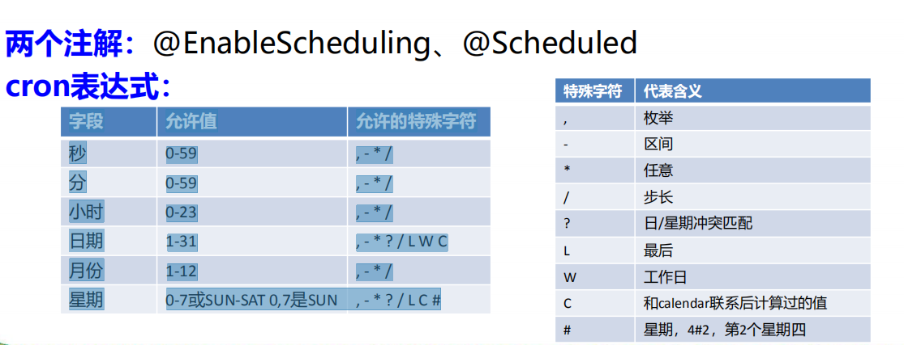

定时任务 


项目开发中经常需要执行一些定时任务，比如需要在每天凌晨时候，分析一次前 

一天的日志信息。Spring为我们提供了异步执行任务调度的方式，提供 

TaskExecutor 、TaskScheduler 接口。





```java

@EnableScheduling //开启基于注解的定时任务
@SpringBootApplication
public class Springboot04TaskApplication {

	public static void main(String[] args) {
		SpringApplication.run(Springboot04TaskApplication.class, args);
	}
}


@Service
public class ScheduledService {

    /**
     * second(秒), minute（分）, hour（时）, day of month（日）, month（月）, day of week（周几）.
     * 0 * * * * MON-FRI
     * 【0 0/5 14,18 * * ?】 每天14点整，和18点整，每隔5分钟执行一次
     * 【0 15 10 ? * 1-6】 每个月的周一至周六10:15分执行一次
     * 【0 0 2 ? * 6L】每个月的最后一个周六凌晨2点执行一次
     * 【0 0 2 LW * ?】每个月的最后一个工作日凌晨2点执行一次
     * 【0 0 2-4 ? * 1#1】每个月的第一个周一凌晨2点到4点期间，每个整点都执行一次；
     */
    // @Scheduled(cron = "0 * * * * MON-SAT")
    // @Scheduled(cron = "0,1,2,3,4 * * * * MON-SAT")
    // @Scheduled(cron = "0-4 * * * * MON-SAT")
    @Scheduled(cron = "0/4 * * * * MON-SAT")  //每4秒执行一次
    public void hello() {
        System.out.println("hello ... ");
    }
}


```

