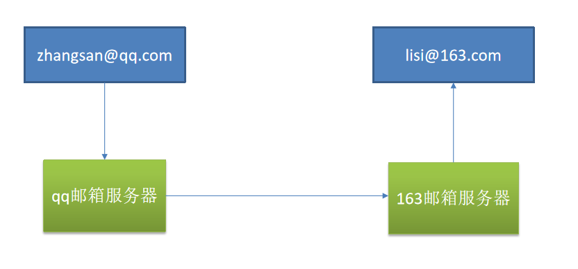
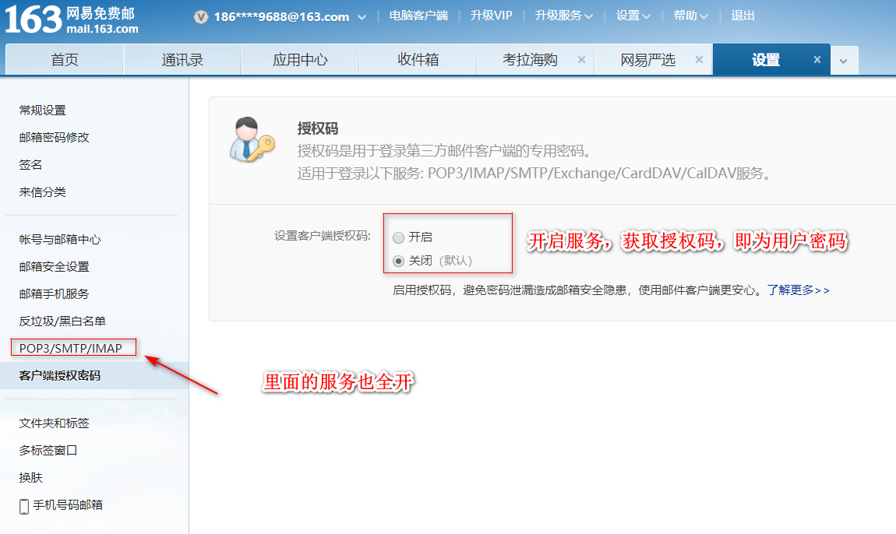

邮件发送需要引入spring-boot-starter-mail
Spring Boot 自动配置MailSenderAutoConfiguration
定义MailProperties内容，配置在application.yml中
自动装配JavaMailSender
测试邮件发送








配置属性

```
spring.mail.username=534096094@qq.com 	//用户名
spring.mail.password=gtstkoszjelabijb	//获取的授权码
spring.mail.host=smtp.qq.com			//SMTP服务器
spring.mail.properties.mail.smtp.ssl.enable=true	//开启ssl协议
```


```java

/**
 * springboot测试类
 */
@RunWith(SpringRunner.class)
@SpringBootTest
public class Springboot04TaskApplicationTests {

    @Autowired
    JavaMailSenderImpl mailSender;

    /**
     * 简单邮件（主题，内容）
     */
    @Test
    public void contextLoads() {
        SimpleMailMessage message = new SimpleMailMessage();
        //邮件设置
        //主题
        message.setSubject("通知-今晚开会");
        //内容
        message.setText("今晚7:30开会");

        message.setTo("17512080612@163.com");
        message.setFrom("534096094@qq.com");

        mailSender.send(message);
    }

    /**
     * 复杂邮件（主题，html内容，附件）
     *
     * @throws Exception
     */
    @Test
    public void test02() throws Exception {
        //1、创建一个复杂的消息邮件
        MimeMessage mimeMessage = mailSender.createMimeMessage();
        MimeMessageHelper helper = new MimeMessageHelper(mimeMessage, true);

        //邮件设置
        helper.setSubject("通知-今晚开会");
        //true：代表上传的时thml
        helper.setText("<b style='color:red'>今天 7:30 开会</b>", true);

        helper.setTo("17512080612@163.com");
        helper.setFrom("534096094@qq.com");

        //上传附件
        helper.addAttachment("1.jpg", new File("C:\\Users\\lfy\\Pictures\\Saved Pictures\\1.jpg"));
        helper.addAttachment("2.jpg", new File("C:\\Users\\lfy\\Pictures\\Saved Pictures\\2.jpg"));

        mailSender.send(mimeMessage);
    }
}
```

