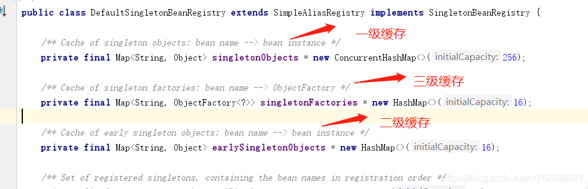
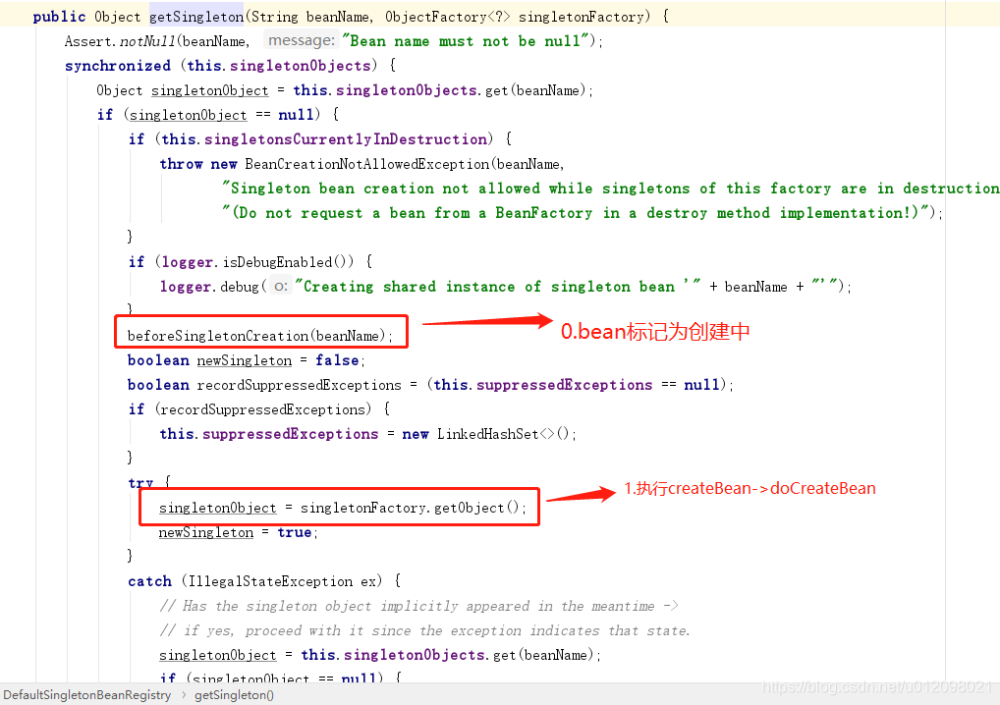
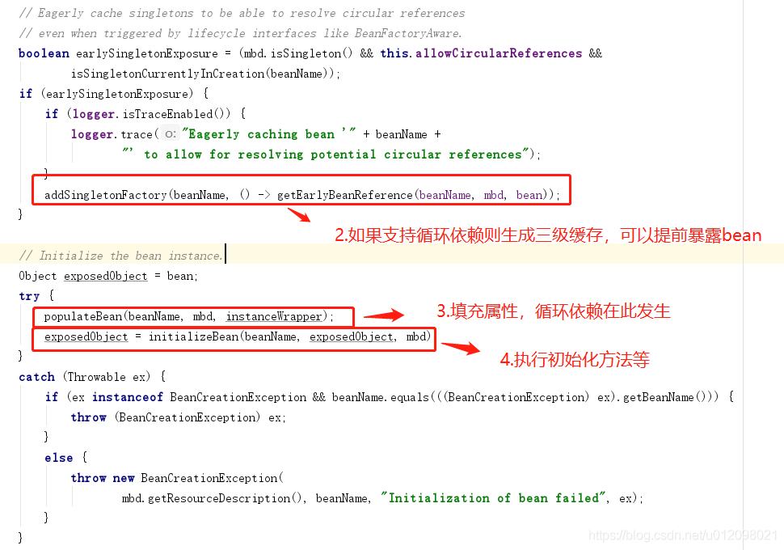
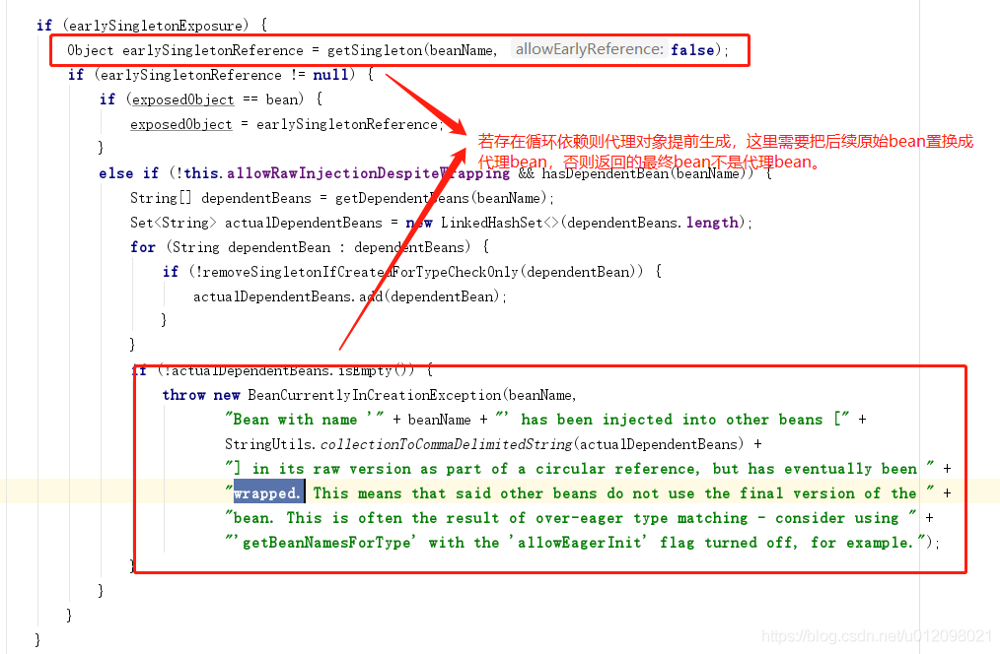
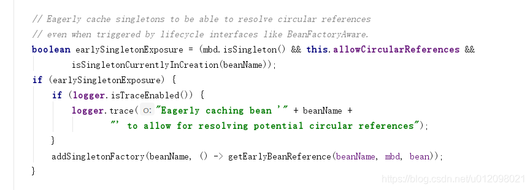
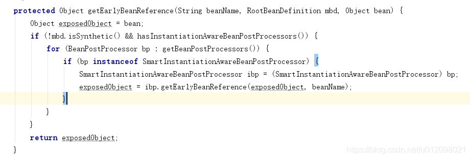
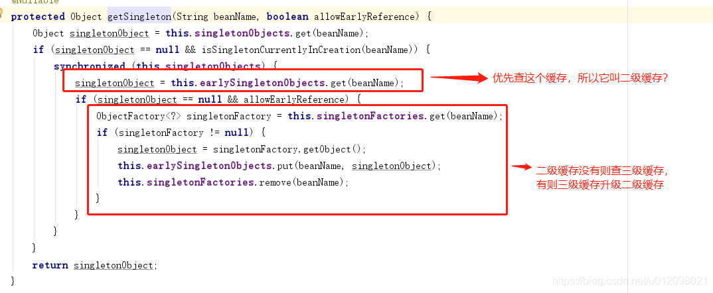

https://blog.csdn.net/u012098021/article/details/107352463/

二级缓存就是为了解决循环依赖

先将未完全创建的A放入二级缓存，依赖的B再去找A时就能在二级缓存中找到，然后完成各自的最终创建

Spring在启动过程中，使用到了三个map，称为三级缓存。

Spring启动过程大致如下：
1.加载配置文件
2.解析配置文件转化beanDefination，获取到bean的所有属性、依赖及初始化用到的各类处理器等
3.创建beanFactory并初始化所有单例bean
4.注册所有的单例bean并返回可用的容器，一般为扩展的applicationContext

### 一级缓存

在第三步中，所有单例的bean初始化完成后会存放在一个Map(**singletonObjects**)中，beanName为key，单例bean为value。

第三步单例bean的初始化过程大致如下：
0.标记bean为创建中
1.new出bean对象
2.如果支持循环依赖则生成三级缓存，可以提前暴露bean
3.填充bean属性，解决属性依赖
4.初始化bean，处理Aware接口并执行各类bean后处理器，执行初始化方法，如果需要生成aop代理对象
5.如果存在循环依赖，解决之 – **这里有点问题，这一步是如果之前解决了aop循环依赖，则缓存中放置了提前生成的代理对象，然后使用原始bean继续执行初始化，所以需要再返回最终bean前，把原始bean置换为代理对象返回**。
6.此时bean已经可以被使用，进行bean注册(标记)并注册销毁方法。
7.将bean放入容器中(一级缓存)，移除创建中标记及二三级缓存(后面再具体分析)

### 循环依赖及三级缓存

根据以上步骤可以看出bean初始化是一个相当复杂的过程，假如**初始化A bean时，发现A bean依赖B bean**,即A初始化执行到了第2步，此时B还没有初始化，则需要暂停A，先去初始化B，那么此时new出来的A对象放哪里，直接放在容器Map里显然不合适，半残品怎么能用，所以需要提供一个可以**标记创建中bean(A)的Map，可以提前暴露正在创建的bean供其他bean依赖**，如果在初始化A所依赖的bean B时，发现B也需要注入一个A的依赖，则**B可以从创建中的beanMap中直接获取A对象（创建中）注入A**，然后完成B的初始化，返回给正在注入属性的A，最终A也完成初始化，皆大欢喜。

如果配置不允许循环依赖，则上述缓存就用不到了，A 依赖B，就是创建B，B依赖C就去创建C，创建完了逐级返回就行，所以，**一级缓存之后的其他缓存(二三级缓存)就是为了解决循环依赖**！而配置支持循环依赖后，就一定要解决循环依赖吗？肯定不是！循环依赖在实际应用中也有，但不会太多，简单的应用场景是： controller注入service，service注入mapper，只有复杂的业务，可能service互相引用，有可能出现循环依赖，所以为了**出现循环依赖才去解决，不出现就不解决，虽然支持循环依赖，但是只有在出现循环依赖时才真正暴露早期对象，否则只暴露个获取bean的方法，并没有真正暴露bean，因为这个方法不会被执行到，这块的实现就是三级缓存（singletonFactories），只缓存了一个单例bean工厂**。

这个bean工厂不仅可以暴露早期bean还可以暴露代理bean，如果存在aop代理，则依赖的应该是代理对象，而不是原始的bean。而暴露原始bean是在单例bean初始化的第2步，填充属性第3步，生成代理对象第4步，这就矛盾了，A依赖到B并去解决B依赖时，要去初始化B，然后B又回来依赖A，而此时A还没有执行代理的过程，所以，需要在填充属性前就生成A的代理并暴露出去，第2步时机就刚刚好。

三级缓存的bean工厂getObject方式，实际执行的是getEarlyBeanReference，如果对象需要被代理(存在beanPostProcessors -> SmartInstantiationAwareBeanPostProcessor)，则提前生成代理对象。

### 二级缓存

根据以上步骤可以看出bean初始化是一个相当复杂的过程，但是貌似三级缓存已经解决所有问题了，二级缓存用来做什么呢？为什么三级缓存不直接叫做二级缓存?这个应该是在缓存使用时决定的：

三级缓存中提到**出现循环依赖才去解决**，也就是说出现循环依赖时，才会执行工厂的getObject生成(获取)早期依赖，这个时候就需要给它挪个窝了，因为真正暴露的不是工厂，而是对象，所以需要使用一个新的缓存保存暴露的早期对象(**earlySingletonObjects**)，同时移除提前暴露的工厂，也不需要在多重循环依赖时每次去执行getObject(虽然个人觉得不会出问题，因为代理对象不会重复生成，详细可以了解下代理里面的逻辑，如wrapIfNecessary)。

此篇修改多次，每次有惊喜！循环依赖这块的理解希望不会再有理解错误或者不到位的地方，如仍有错误，欢迎指出，欢迎探讨！