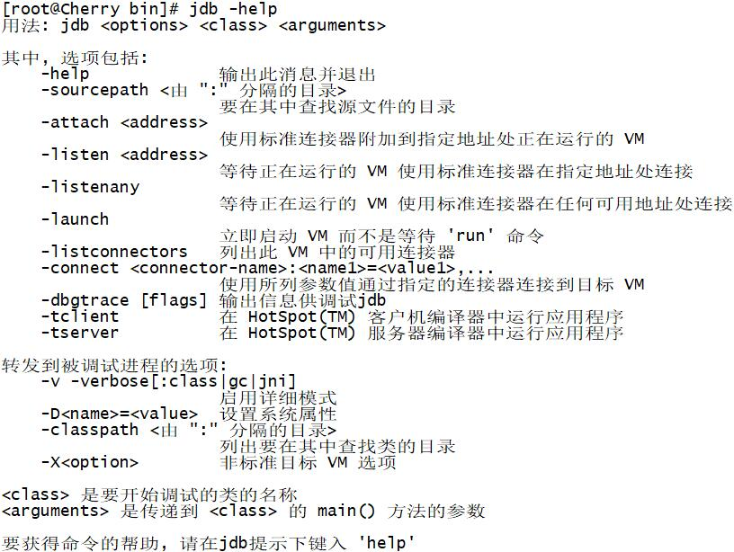
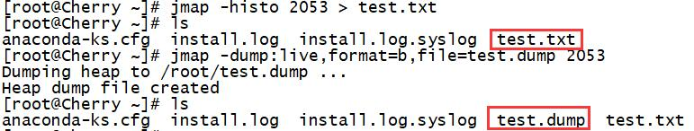

JVM监控工具之jmap、jstat、stack、jps、jstatd、jinfo、jhat、jdb

https://www.cnblogs.com/L-Test/p/9498800.html

jmap堆转储 jhat html分析

jmap -histo:alive直接查看存活对象

**1、jdb（The Java Debuger）**

 　jdb 用来对core文件和正在运行的Java进程进行实时地调试，里面包含了丰富的命令帮助您进行调试，它的功能和Sun studio里面所带的dbx非常相似，但 jdb是专门用来针对Java应用程序的。

　　现在应该说日常的开发中很少用到JDB了，因为现在的IDE已经帮我们封装好了，如使用ECLIPSE调用程序就是非常方便的，只要在非常特定的情况下可能会用到这个命令，如远程服务器的维护，没有IDE进行调试，那这个时候JDB应该可以帮上忙。

**2、jstatd（JVM monitoring tool jstatd）**

　　jstatd是一个基于RMI（Remove Method Invocation）的服务程序，它用于监控基于HotSpot的JVM中资源的创建及销毁，并且提供了一个远程接口允许远程的监控工具连接到本地的JVM执行命令。

　　jstatd是基于RMI的，所以在运行jstatd的服务器上必须存在RMI注册中心，如果没有通过选项"-p port"指定要连接的端口，jstatd会尝试连接RMI注册中心的默认端口。

| Option     | Function                                               |
| ---------- | ------------------------------------------------------ |
| -nr        | 如果RMI注册中心没有找到，不会创建一个内部的RMI注册中心 |
| -p port    | RMI注册中心的端口号，默认为1099                        |
| -n rminame | 默认为JStatRemoteHost                                  |

| -j   | 用于传递jvm选项到由javac调用的java加载器中 |
| ---- | ------------------------------------------ |
|      |                                            |

**3、jinfo（JVM configuration Info for Java）**

　　jinfo的作用是实时查看虚拟机的各项参数信息jps –v可以查看虚拟机在启动时被显式指定的参数信息，但是如果你想知道默认的一些参数信息呢？除了去查询对应的资料以外，jinfo就显得很重要了。jinfo的用法如下：

参数选项说明如下：

| Option    | Function                 |
| --------- | ------------------------ |
| no option | 输出命令行参数和系统属性 |
| -flags    | 输出命令行参数           |
| -sysprops | 输出系统属性             |

**4、jps（Java Virtual Machine Process Status Tool）**

　　jps是参照Unix系统的取名规则命名的，而他的功能和ps的功能类似，可以列举正在运行的JAVA虚拟机进程并显示虚拟机执行的主类以及这些进程的唯一ID（LVMID，对应本机来说和PID相同），他的用法如下：

如果不指定hostid就默认为当前主机或服务器

参数选项说明如下：

| Option | Function                                 |
| ------ | ---------------------------------------- |
| -q     | 只输出LVMID                              |
| -m     | 输出JVM启动时传给主类的方法              |
| -l     | 输出主类的全名，如果是Jar则输出jar的路径 |
| -v     | 输出JVM的启动参数                        |

**5、jstack（JVM Stack Trace for java）**

　　jstack用于JVM当前时刻的线程快照，又称threaddump文件，它是JVM当前每一条线程正在执行的堆栈信息的集合。生成线程快照的主要目的是为了定位线程出现长时间停顿的原因，如线程死锁、死循环、请求外部时长过长导致线程停顿的原因。通过jstack我们就可以知道哪些进程在后台做些什么？在等待什么资源等！其运行格式如下： 

相关的option和function如下表所示：

| Option | Function                                 |
| ------ | ---------------------------------------- |
| -F     | 当正常输出的请求不响应时强制输出线程堆栈 |
| -l     | 除堆栈信息外，显示关于锁的附加信息       |
| -m     | 显示native方法的堆栈信息                 |

****

**6、jstat（JVM Statistics Monitoring Tools）**

　　jstat主要用于监控虚拟机的各种运行状态信息，如类的装载、内存、垃圾回收、JIT编译器等，在没有GUI的服务器上，这款工具是首选的一款监控工具。其用法如下：

参数interval和count分别表示查询间隔和查询次数，如每2000毫秒查询一次进程2053的垃圾回收情况，监控5次，命令如下所示：

选项option代表用户需要查询的虚拟机的信息，主要分为3类：类装载、垃圾回收和运行期的编译情况，具体如下表所示：

| Option            | Function                                                     |
| ----------------- | ------------------------------------------------------------ |
| -class            | 监视类的装载、卸载数量以及类的装载总空间和耗费时间等         |
| -gc               | 监视Java堆，包含eden、2个survivor区、old区和永久带区域的容量、已用空间、GC时间合计等信息 |
| -gccapcity        | 监视内容与-gc相同，但输出主要关注Java区域用到的最大和最小空间 |
| -gcutil           | 监视内容与-gc相同，但输出主要关注已使用空间占总空间的百分比  |
| -gccause          | 与-gcutil输出信息相同，额外输出导致上次GC产生的原因          |
| -gcnew            | 监控新生代的GC情况                                           |
| -gcnewcapacity    | 与-gcnew监控信息相同，输出主要关注使用到的最大和最小空间     |
| -gcold            | 监控老生代的GC情况                                           |
| -gcoldcapacity    | 与-gcold监控信息相同，输出主要关注使用到的最大和最小空间     |
| -gcpermcapacity   | 输出永久带用到的最大和最小空间                               |
| -compiler         | 输出JIT编译器编译过的方法、耗时信息                          |
| -printcompilation | 输出已经被JIT编译的方法                                      |

**7、jmap（JVM Memory Map for Java）**

　　jmap用于生成堆快照（heapdump）。当然我们有很多方法可以取到对应的dump信息，如我们通过JVM启动时加入启动参数 –XX:HeapDumpOnOutOfMemoryError参数，可以让JVM在出现内存溢出错误的时候自动生成dump文件，亦可以通过-XX:HeapDumpOnCtrlBreak参数，在运行时使用ctrl+break按键生成dump文件，当然我们也可以使用kill -3 pid的方式去恐吓JVM生成dump文件。jmap的作用不仅仅是为了获取dump文件，还可以用于查询finalize执行队列、Java堆和永久带的详细信息，如空间使用率、垃圾回收器等。其运行格式如下： 

Option的信息如下表所示：

| Option         | Function                                                     |
| -------------- | ------------------------------------------------------------ |
| -dump          | 生成对应的dump信息，用法为-dump:[live,]format=b,file={fileName} |
| -finalizerinfo | 显示在F-Queue中等待的Finalizer方法的对象（只在linux下生效）  |
| -heap          | 显示堆的详细信息、垃圾回收器信息、参数配置、分代详情等       |
| -histo         | 显示堆栈中的对象的统计信息，包含类、实例数量和合计容量       |
| -permstat      | 以ClassLoder为统计口径显示永久带的内存状态                   |
| -F             | 当虚拟机对-dump无响应时可使用这个选项强制生成dump快照        |

****

**8、jhat（JVM Heap Analysis Tool）**

　　jhat是用来分析dump文件的一个微型的HTTP/HTML服务器，它能将生成的dump文件生成在线的HTML文件，让我们可以通过浏览器进行查阅，然而实际中我们很少使用这个工具，因为一般服务器上设置的堆、栈内存都比较大，生成的dump也比较大，直接用jhat容易造成内存溢出，而是我们大部分会将对应的文件拷贝下来，通过其他可视化的工具进行分析。启用法如下：

 

执行命令后，我们看到系统开始读取这段dump信息，当系统提示Server is ready的时候，用户可以通过在浏览器键入http://ip:7000进行查询，如下图：

