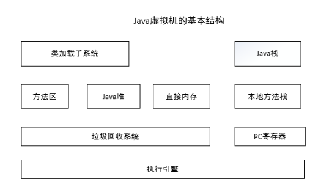
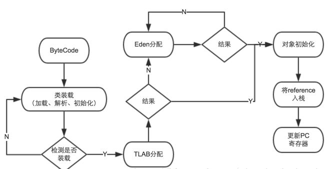
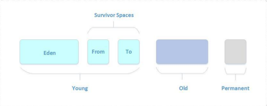

https://www.cnblogs.com/eric-fang/p/9004121.html


一、jvm简单结构图

　　　　

　　1、jvm内存对象分配整体流程：

　　　　

　　1、类加载子系统和方法区

　　　　类加载子系统负责从文件系统或者网络中加载Class信息，加载的类信息存放于一块称为方法区的内存空间。除了类的信息外，

　　　　方法区中可能还会存放运行时常量池信息，包括字符串字面量和数字常量（这部分常量信息是Class文件中常量池部分的内存映射）。

　　2、java堆

　　　　堆空间在jvm启动的时候即根据设置（后续 jvm参数调优）创建，是java程序中最主要的内存工作区域。堆空间是所有线程共享的。

　　　　jvm分配对象，一般来说，new个新对象，都是分配在堆空间的。其实这也不是绝对的，存在部分对象的分配是在栈上以及TLAB中。

　　　　TLAB：全称 Thread Local Allocation Buffer，线程本地分配缓存区，是一个为线程分配的专用的内存使用区域。在使用参数 -XX:UseTLAB 打开设置的时候，在进行

　　　　　　　　线程初始化的时候，会去分配一小块的内存区域供线程使用，这样如果使用，直接在自己的内存区域就可以直接分配使用了，提高效率。

　　　　　　　　默认的空间大小为Eden区的 1%，-XX:TLABWasteTargetPercent可以设置 TLAB 占 Eden区的百分比大小。

　　　　对象分配流程图：

　　　　

　　上图：如果开启栈上分配，JVM会先进行栈上分配，如果没有开启栈上分配或则不符合条件的则会进行TLAB分配，如果TLAB分配不成功，再尝试在eden区分配，如果对象满足了直接进入老年代的条件①，那就直接分配在老年代。

①：大对象可直接进入老年代

　　大对象是指需要大量的连续的内存空间的java对象，典型的例子就是N长的字符串和数组。大对象在分配的时候，很纠结，很可能会出现提前触发GC来获取到足够的连续的空间来分配他们。JVM提供了一个值参数: -XX:PreteenureSizeThreshold参数，让对象大于这个参数时直接进入老年代分配。这样做，可以避免年轻代Eden和两个Survivor区域发生大量的内存复制，提高效率。

　　　2.1、栈上分配

[](javascript:void(0);)

```
在JVM中，堆是线程共享的，因此堆上的对象对于各个线程都是共享和可见的，只要持有对象的引用，就可以访问堆中存储的对象数据。虚拟机的垃圾收集系统可以回收堆中不再使用的对象，但对于垃圾收集器来说，无论筛选可回收对象，还是回收和整理内存都需要耗费时间。
如果确定一个对象的作用域不会逃逸出方法之外，那可以将这个对象分配在栈上，这样，对象所占用的内存空间就可以随栈帧出栈而销毁。在一般应用中，不会逃逸的局部对象所占的比例很大，如果能使用栈上分配，那大量的对象就会随着方法的结束而自动销毁了，无须通过垃圾收集器回收，可以减小垃圾收集器的负载。
JVM允许将线程私有的对象打散分配在栈上，而不是分配在堆上。分配在栈上的好处是可以在函数调用结束后自行销毁，而不需要垃圾回收器的介入，从而提高系统性能。
```

　　栈上分配的技术基础： 
　　　　一是逃逸分析：逃逸分析的目的是判断对象的作用域是否有可能逃逸出函数体。关于逃逸分析的问题可以看我另一篇文章：

　　　　二是标量替换：允许将对象打散分配在栈上，比如若一个对象拥有两个字段，会将这两个字段视作局部变量进行分配。

只能在server模式下才能启用逃逸分析，参数-XX:DoEscapeAnalysis启用逃逸分析，参数-XX:+EliminateAllocations开启标量替换（默认打开）。选项-XX:+PrintEscapeAnalysis查看逃逸分析的筛选结果。

注意：在部分JDK1.6版本和后续的JDK版本(64位系统)中，-client参数已经不起作用了，Server模式成为唯一

[](javascript:void(0);)

　　2.2、TLAB分配

[](javascript:void(0);)

```
TLAB的全称是Thread Local Allocation Buffer，即线程本地分配缓存区，这是一个线程专用的内存分配区域。 
由于对象一般会分配在堆上，而堆是全局共享的。因此在同一时间，可能会有多个线程在堆上申请空间。因此，每次对象分配都必须要进行同步（虚拟机采用CAS配上失败重试的方式保证更新操作的原子性），而在竞争激烈的场合分配的效率又会进一步下降。JVM使用TLAB来避免多线程冲突，在给对象分配内存时，每个线程使用自己的TLAB，这样可以避免线程同步，提高了对象分配的效率。 
TLAB本身占用eEden区空间，在开启TLAB的情况下，虚拟机会为每个Java线程分配一块TLAB空间。参数-XX:+UseTLAB开启TLAB，默认是开启的。TLAB空间的内存非常小，缺省情况下仅占有整个Eden空间的1%，当然可以通过选项-XX:TLABWasteTargetPercent设置TLAB空间所占用Eden空间的百分比大小。 
由于TLAB空间一般不会很大，因此大对象无法在TLAB上进行分配，总是会直接分配在堆上。TLAB空间由于比较小，因此很容易装满。比如，一个100K的空间，已经使用了80KB，当需要再分配一个30KB的对象时，肯定就无能为力了。这时虚拟机会有两种选择，第一，废弃当前TLAB，这样就会浪费20KB空间；第二，将这30KB的对象直接分配在堆上，保留当前的TLAB，这样可以希望将来有小于20KB的对象分配请求可以直接使用这块空间。实际上虚拟机内部会维护一个叫作refill_waste的值，当请求对象大于refill_waste时，会选择在堆中分配，若小于该值，则会废弃当前TLAB，新建TLAB来分配对象。这个阈值可以使用TLABRefillWasteFraction来调整，它表示TLAB中允许产生这种浪费的比例。默认值为64，即表示使用约为1/64的TLAB空间作为refill_waste。默认情况下，TLAB和refill_waste都会在运行时不断调整的，使系统的运行状态达到最优。如果想要禁用自动调整TLAB的大小，可以使用-XX:-ResizeTLAB禁用ResizeTLAB，并使用-XX:TLABSize手工指定一个TLAB的大小。 
-XX:+PrintTLAB可以跟踪TLAB的使用情况。一般不建议手工修改TLAB相关参数，推荐使用虚拟机默认行为。
```

[](javascript:void(0);)

 　3、java栈

　　每一个java虚拟机线程都有一个私有的java栈，一个线程的java栈在线程创建的时候被创建，java栈中保存着帧信息，

　　java栈中保存着局部变量、方法参数，同时和java方法的调用、返回密切相关。

　　4、垃圾回收

　　垃圾回收系统是java虚拟机的重要组成部分，垃圾回收器可以对方法区、java堆和直接内存进行回收。其中，java堆是垃圾收集器的工作重点。和C/C++不同，java中所有的对象空间释放都是隐式的，也就是说，java中没有类似free()或者delete()这样的函数释放指定的内存区域。对于不再使用的垃圾对象，垃圾回收系统会在后台默默工作，默默查找、标识并释放垃圾对象，完成包括java堆、方法区和直接内存中的全自动化管理。

　　5、执行引擎

[](javascript:void(0);)

```
执行引擎是java虚拟机的最核心组件之一，它负责执行虚拟机的字节码，现代虚拟机为了提高执行效率，会使用即时编译(just in time)技术将方法编译成机器码后再执行。Java HotSpot Client VM(-client)，为在客户端环境中减少启动时间而优化的执行引擎；本地应用开发使用。（如：eclipse）Java HotSpot Server VM(-server)，为在服务器环境中最大化程序执行速度而设计的执行引擎。应用在服务端程序。（如：tomcat）Java HotSpot Client模式和Server模式的区别当虚拟机运行在-client模式的时候,使用的是一个代号为C1的轻量级编译器, 而-server模式启动的虚拟机采用相对重量级,代号为C2的编译器. C2比C1编译器编译的相对彻底,服务起来之后,性能更高JDK安装目录/jre/lib/（x86、i386、amd32、amd64）/jvm.cfg文件中的内容，-server和-client哪一个配置在上，执行引擎就是哪一个。如果是JDK1.5版本且是64位系统应用时，-client无效。--64位系统内容　　-server KNOWN　　-client IGNORE--32位系统内容　　-server KNOWN　　-client KNOWN注意：在部分JDK1.6版本和后续的JDK版本(64位系统)中，-client参数已经不起作用了，Server模式成为唯一
```

[](javascript:void(0);)

 

二、对象分代结构

　　JVM根据对象存活周期的不同，将堆分成几个不同的结构区域，一般来说是分为：新生代（young）、老年代（old）、永久代（permanent）。

　　2.1、为什么要进行分代

　　　　堆内存是虚拟机管理的最大的一块内存区域，也是垃圾回收最为频繁的区域。程序运行时的所有对象实例都在这里保存。内存分代管理就是为对象的内存分配和销毁回收提高效率。试想一下，如果不进行分代划分，所有的对象都放在一起，那些新生的和一些 　　　　生命周期很长的都在一起，每次进行GC的时候，都必须得扫描遍历全部的对象，这个过程是十分耗费资源的，会严重的影响GC的效率。

　　　　有了内存的分代，会大大提升垃圾回收的效率。新生成的对象在新生代中分配内存，经过几次的垃圾回收依然存活下来的就存放到老年代中，永久代中存放静态属性以及类信息等。新生代中的对象，生命周期最短，相对的来说GC的频率就很高。老年代的生命

　　　　周期较长，不需要进行频繁的内存回收。永久代基本不需要进行回收操作。当然了，回收机制是可以根据不同代的特点来选择合适的垃圾回收算法的。

　　2.2、内存分代

　　　　 JVM将内存分为新生代（Eden、Survivor：From和To）、老年代以及永久代。永久代中主要存放静态变量、常量以及类信息等，基本不进行垃圾回收。新生代和老年代是垃圾回收的主要区域。

　　　　 内存的分代示意图如下：

　　　　 

　　　　2.2.1、新生代

　　　　　　新生代是程序运行过程中，大部分新生成的对象分配的区域。新生代对象，生命周期很短，垃圾回收相当的频繁，一般，一次的垃圾回收，能回收掉70-90的空间，回收效率很高。

　　　　　　新生代分为三块：一块较大的Eden区和两块较小的Survivor区（两块大小相同），默认的大小比率为8:1:1，划分的目的是因为Hotspot采用复制算法来回收新生代，设置这个比率充分利用内存空间，减少浪费。

　　　　　　Eden区分配新生成的对象（大对象出外，上面有提及），当Eden区没有足够的空间去分配新对象的时候，出发一次minor GC。

　　　　　　程序运行中，To区域始终需要保持空状态，对象保存在Eden和From区域。新生成对象首先是存放在Eden区域的，当触发Minor GC的时候，将Eden中幸存对象拷贝到From区域中并且年龄加1，然后检查To区域已有

　　　　　　对象是否可达可用，如若不需要了，对其进行一次清理，幸存的对象年龄加1。将From区域的对象拷贝过来，最后交换From与To的名称。保持To区域的空。

　　　 2.2.2、老年代

　　　　　　新生代young中，经过了多次的GC后还能幸存下来的对象（具体的多少次，可进行设置阈值控制，默认15），进入老年代中。老年代中的对象，生命周期长，GC的频率低，并且回收的效率上也相对较低。

　　　 2.2.3、永久代

　　　　　　永久代中存储的是类信息、常量、静态变量等数据。一般不进行GC。