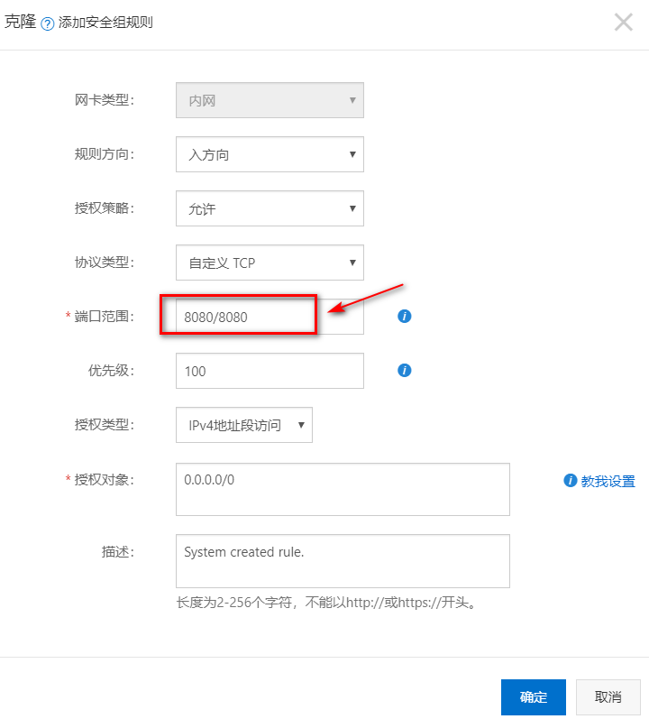
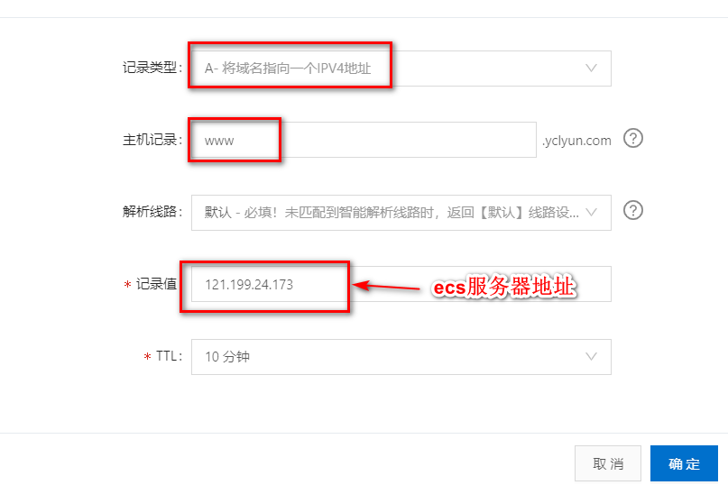

1、购买阿里云ECS服务器，适合小型服务

2、控制台->云服务器ECS->实例与镜像->修改实例密码和远程连接密码

3、控制台->云服务器ECS->网络与安全->安全组->点击列表一个，配置规则->安全组规则->入方向->点击列表一个,克隆->添加端口8080/8080和80/80  （mysql、redis同理将端口暴露）

4、域名服务->域名列表->点击列表一个，解析->添加记录->

5、使用xshell连接，使用winSCP进行文件传输

6、安装jdk           yum install -y java-1.8.0-openjdk

