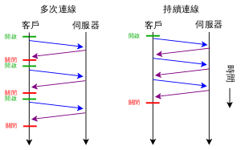

https://blog.csdn.net/luzhensmart/article/details/87186401


keep-Alive

[https://zh.wikipedia.org/wiki/HTTP%E6%8C%81%E4%B9%85%E8%BF%9E%E6%8E%A5](https://zh.wikipedia.org/wiki/HTTP持久连接)

```
Connection: Keep-Alive
```

## 操作[[编辑](https://zh.wikipedia.org/w/index.php?title=HTTP持久连接&action=edit&section=1)]

**在 HTTP 1.0 中**, 没有官方的 keepalive 的操作。通常是在现有协议上添加一个指数。如果浏览器支持 keep-alive，它会在请求的包头中添加：

```
Connection: Keep-Alive
```

然后当服务器收到请求，作出回应的时候，它也添加一个头在响应中：

```
Connection: Keep-Alive
```

这样做，连接就不会中断，而是保持连接。当客户端发送另一个请求时，它会使用同一个连接。这一直继续到客户端或服务器端认为会话已经结束，其中一方中断连接。

**在 HTTP 1.1 中** 所有的连接默认都是持续连接，除非特殊声明不支持。[[1\]](https://zh.wikipedia.org/wiki/HTTP持久连接#cite_note-1) HTTP 持久连接不使用独立的 keepalive 信息，而是仅仅允许多个请求使用单个连接。然而， Apache 2.0 httpd 的默认连接过期时间[[2\]](https://zh.wikipedia.org/wiki/HTTP持久连接#cite_note-2) 是仅仅15秒[[3\]](https://zh.wikipedia.org/wiki/HTTP持久连接#cite_note-3) ，对于 Apache 2.2 只有5秒。[[4\]](https://zh.wikipedia.org/wiki/HTTP持久连接#cite_note-4) 短的过期时间的优点是能够快速的传输多个web页组件，而不会绑定多个服务器进程或线程太长时间。[[5\]](https://zh.wikipedia.org/wiki/HTTP持久连接#cite_note-5)

## 优势[[编辑](https://zh.wikipedia.org/w/index.php?title=HTTP持久连接&action=edit&section=2)]

- 较少的[CPU](https://zh.wikipedia.org/wiki/CPU)和内存的使用（由于同时打开的连接的减少了）
- 允许请求和应答的[HTTP管线化](https://zh.wikipedia.org/wiki/HTTP管線化)
- 降低[拥塞控制](https://zh.wikipedia.org/wiki/拥塞控制) （[TCP连接](https://zh.wikipedia.org/wiki/传输控制协议)减少了）
- 减少了后续请求的[延迟](https://zh.wikipedia.org/wiki/延遲_(電腦))（无需再进行[握手](https://zh.wikipedia.org/wiki/握手_(技术))）
- 报告错误无需关闭TCP连接

根据RFC 2616 （47页），用户客户端与任何服务器和代理服务器之间不应该维持超过2个链接。[代理服务器](https://zh.wikipedia.org/wiki/代理服务器)应该最多使用2×N个持久连接到其他服务器或代理服务器，其中N是同时活跃的用户数。这个指引旨在提高HTTP响应时间并避免阻塞。

## 劣势[[编辑](https://zh.wikipedia.org/w/index.php?title=HTTP持久连接&action=edit&section=3)]

对于现在的广泛普及的宽带连接来说，Keep-Alive也许并不像以前一样有用。web服务器会保持连接若干秒(Apache中默认15秒)，这与提高的性能相比也许会影响性能。

对于单个文件被不断请求的服务(例如图片存放网站)，Keep-Alive可能会极大的影响性能，因为它在文件被请求之后还保持了不必要的连接很长时间。

## Web浏览器中的使用[[编辑](https://zh.wikipedia.org/w/index.php?title=HTTP持久连接&action=edit&section=4)]

[](https://zh.wikipedia.org/w/index.php?title=File:HTTP_persistent_connection.svg&lang=zh)

使用多个连接和使用持久链接的对比

[网景导航者](https://zh.wikipedia.org/wiki/网景导航者)（4.05版本以后）和[Internet Explorer](https://zh.wikipedia.org/wiki/Internet_Explorer)（4.01版本以后）支持使用持久链接链接Web服务器和代理服务器。

网景不使用过时时间来关闭持久连接。而是对所有空闲的持久链接进行排队。当需要打开一个新的持久链接，但连接到不同的服务器上时，浏览器使用[最近最少使用算法](https://zh.wikipedia.org/w/index.php?title=最近最少使用算法&action=edit&redlink=1)终止一个空闲的持久链接。[[6\]](https://zh.wikipedia.org/wiki/HTTP持久连接#cite_note-6)

[Internet Explorer](https://zh.wikipedia.org/wiki/Internet_Explorer)支持持久链接，IE 6和IE 7缺省使用2个持久链接，而IE 8缺省使用6个持久链接。[[7\]](https://zh.wikipedia.org/wiki/HTTP持久连接#cite_note-7) 持久链接在不活跃60秒后过时，可以在Windows注册表中修改。[[8\]](https://zh.wikipedia.org/wiki/HTTP持久连接#cite_note-8)

[Mozilla Firefox](https://zh.wikipedia.org/wiki/Mozilla_Firefox)支持持久链接。可以定制同时的持久连接的最大个数（每个服务器，每个代理服务器，总数）。连接在不活跃300秒（5分钟）后过时（配置中可以修改）。[[9\]](https://zh.wikipedia.org/wiki/HTTP持久连接#cite_note-9)

[Opera](https://zh.wikipedia.org/wiki/Opera) 4.0版本开始支持持久链接.[[10\]](https://zh.wikipedia.org/wiki/HTTP持久连接#cite_note-10) 可以配置同时的持久连接的最大个数（每个服务器，总数）。