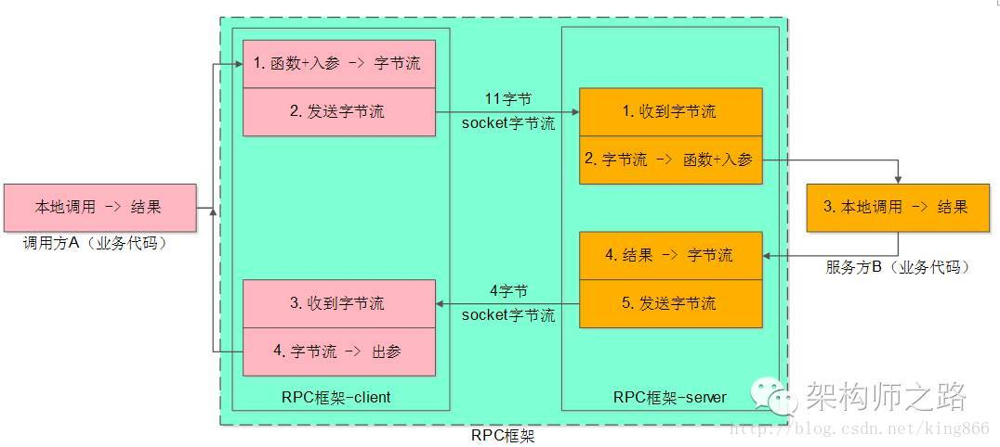

https://www.cnblogs.com/xingzc/p/9014096.html

# [分布式调用技术 RPC VS REST](https://www.cnblogs.com/xingzc/p/9014096.html)

 

一 分布式调用大体上就分为两类，RPC式的，REST式的，两者的区别主要是就是：

\1. RPC是面向动作的（方法调用）

\2. REST是面向资源的（URL表示资源，HTTP动词表示动作）

从变现形式来看，RPC的编程模型较重量级，REST的编程模型更轻量级

 

**二 REST vs RPC**

   REST is not a framework like WCF, a protocol like HTTP, a framework like JAX-RS, or a communication format like SOAP.  REST is an architecture, a structured way of representing a software solution - specifically, exposing aspects of a solution to a set of remote client-consumers.  The central tenet of REST is that these aspects of a solution can be modeled as resources which the client can consume or act upon.  

 

This resource-oriented thinking, and not the implementation details of how one communicates between client and server, is what REST is actually all about.  This is the key difference that separates actual RESTful APIs from RPC based on HTTP verbs.

 

 

三  接口调用通常包含两个部分，**序列化和通信协议**。

   常见的序列化协议包括json、xml、hession、protobuf、thrift、text、bytes等；

   通信比较流行的是http、soap、websockect，RPC通常基于TCP实现，常用框架例如dubbo，netty、mina、thrift。

 

首先解释下两种接口调用：

**Rest**：严格意义上说接口很规范，操作对象即为资源，对资源的四种操作（post、get、put、delete），并且参数都放在URL上,

​     但是不严格的说Http+json、Http+xml，常见的http api都可以称为Rest接口。

**Rpc**:  我们常说的远程方法调用，就是像调用本地方法一样调用远程方法，通信协议大多采用二进制方式

 

**四  http vs 高性能二进制协议**
   http相对更规范，更标准，更通用，无论哪种语言都支持http协议。

​    如果你是对外开放API，例如开放平台，外部的编程语言多种多样，你无法拒绝对每种语言的支持，

​    相应的，如果采用http，无疑在你实现SDK之前，支持了所有语言，

​    所以，现在开源中间件，基本最先支持的几个协议都包含RESTful。

  RPC协议性能要高的多，例如Protobuf、Thrift、Kyro等，

  （如果算上序列化）吞吐量大概能达到http的二倍。响应时间也更为出色。

   千万不要小看这点性能损耗，公认的，[微服务](http://lib.csdn.net/base/microservice)做的比较好的，例如，netflix、阿里，曾经都传出过为了提升性能而合并服务。

   如果是交付型的项目，性能更为重要，因为你卖给客户往往靠的就是性能上微弱的优势。

   

 **无论是Google、Amazon、netflix（据说很可能转向grpc），还是阿里，实际上内部都是采用性能更高的RPC方式。而对外开放的才是RESTful。**

 Rest 调用及测试都很方便，Rpc就显得有点麻烦，但是Rpc的效率是毋庸置疑的，所以建议在多系统之间采用Rpc，对外提供服务，Rest是很适合的
 duboo在生产者和消费者两个微服务之间的通信采用的就是Rpc,无疑在服务之间的调用Rpc更变现的优秀

 

五  Rpc在微服务中的使用

1、 RPC 框架是架构微服务化的首要基础组件 ，

​     它能大大降低架构微服务化的成本，提高调用方与服务提供方的研发效率，屏蔽跨进程调用函数（服务）的各类复杂细节
2、RPC 框架的职责是：

​     让调用方感觉就像调用本地函数一样调用远端函数、让服务提供方感觉就像实现一个本地函数一样来实现服务

 

 

RPC的好处：

   RPC 的主要功能目标是让构建分布式计算（应用）更容易，在提供强大的远程调用能力时不损失本地调用的语义简洁性。

   为实现该目标，RPC 框架需提供一种透明调用机制让使用者不必显式的区分本地调用和远程调用。

   服务化的一个好处就是，不限定服务的提供方使用什么技术选型，能够实现大公司跨团队的技术解耦。 
   如果没有统一的服务框架，RPC框架，

​     各个团队的服务提供方就需要各自实现一套**序列化、反序列化、网络框架、连接池、收发线程、超时处理、状态机等**“业务之外”的重复技术劳动，造成整体的低效。

  所以，统一RPC框架把上述“业务之外”的技术劳动统一处理，是服务化首要解决的问题。

 

六 几种协议

 Socket使用时可以指定协议Tcp,Udp等；

 RIM使用Jrmp协议，Jrmp又是基于TCP/IP；

 RPC底层使用Socket接口，定义了一套远程调用方法；

 HTTP是建立在TCP上，不是使用Socket接口，**需要连接方主动发数据给服务器，服务器无法主动发数据个客户端**；

 Web Service提供的服务是基于web容器的，底层使用http协议，类似一个远程的服务提供者，

​    比如天气预报服务，对各地客户端提供天气预报，是一种请求应答的机制，是跨系统跨平台的。

​    就是通过一个servlet，对外提供服务。
 hessian是一套用于建立web service的简单的二进制协议，

   用于替代基于XML的web service，

   是建立在rpc上的，hessian有一套自己的序列化格式将数据序列化成流，然后通过http协议发送给服务器

 

在微服务架构中，各个服务之间可能千差万别，rest接口更加灵活，如果使用RPC则会有很多约束

 

 

 

参考：

1 https://sites.google.com/site/wagingguerillasoftware/rest-series/what-is-restful-rest-vs-rpc

2 https://blog.csdn.net/iter_zc/article/details/39341983

3 https://blog.csdn.net/king866/article/details/54174665